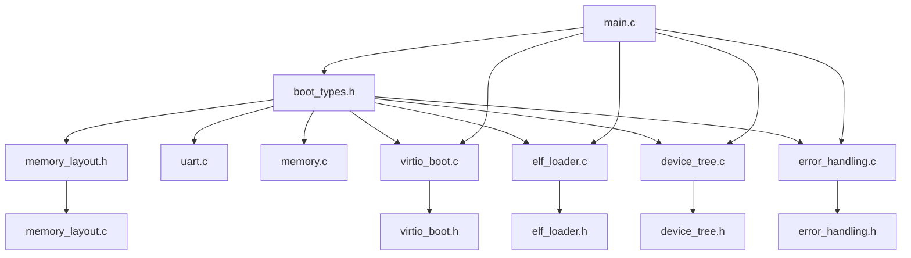
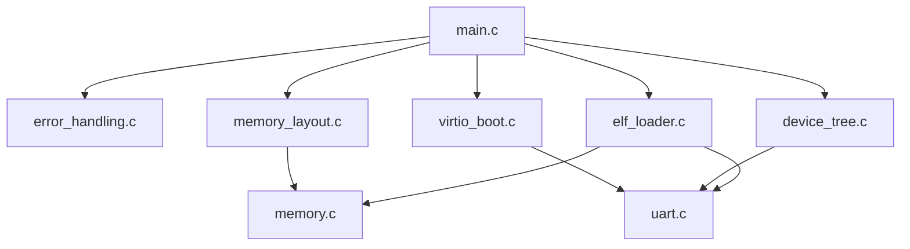

# 代码架构详细说明

## 目录结构和文件组织

```
bootloader/
├── boot.S                    # Stage1 汇编引导程序 (512字节)
├── Makefile                  # 完整构建系统
├── README.md                 # 项目总体说明
├── ARCHITECTURE.md           # 本文件 - 架构详细说明
├── 
├── stage1/                   # 第一阶段引导程序
│   └── boot_stage1.c         # Stage1 C语言实现 (未使用)
├── 
├── stage2/                   # 第二阶段引导程序  
│   ├── main.c                # 主控制逻辑
│   ├── stage2_start.S        # Stage2 汇编入口
│   └── stage2.ld             # 链接器脚本
├── 
├── common/                   # 公共库和驱动
│   ├── boot_info.h           # 引导信息结构定义
│   ├── boot_types.h          # 基础类型定义
│   ├── device_tree.c/.h      # 设备树生成器
│   ├── elf_loader.c/.h       # ELF内核加载器
│   ├── error_handling.c/.h   # 统一错误处理
│   ├── fast_mem.S            # 汇编优化内存操作
│   ├── memory_layout.c/.h    # 内存布局管理
│   ├── memory.c              # 动态内存分配
│   ├── string.c              # 字符串操作
│   ├── uart.c                # UART驱动
│   ├── virtio_boot.c/.h      # VirtIO块设备驱动
│   └── virtio_scan.c         # VirtIO设备扫描
```

## 分层架构设计

### Layer 1: 硬件抽象层 (HAL)

负责直接与硬件交互，提供统一的硬件接口。

```
┌─────────────────────────────────────────┐
│           硬件抽象层 (HAL)                │
├─────────────┬─────────────┬─────────────┤
│   UART      │   VirtIO    │   Memory    │
│   驱动      │   驱动      │   操作      │
├─────────────┴─────────────┴─────────────┤
│         RISC-V 硬件平台                  │
└─────────────────────────────────────────┘
```

**文件组成**:

- `uart.c`: UART串口驱动，提供字符输出
- `virtio_boot.c`: VirtIO块设备驱动，提供磁盘I/O
- `fast_mem.S`: 汇编优化的内存操作
- `memory.c`: 基础内存分配器

### Layer 2: 系统服务层 (System Services)

提供系统级服务和抽象，建立在硬件抽象层之上。

```
┌─────────────────────────────────────────┐
│          系统服务层                      │
├───────────┬───────────┬─────────────────┤
│  内存管理  │  设备管理  │    错误处理      │
├───────────┴───────────┴─────────────────┤
│          硬件抽象层 (HAL)                │
└─────────────────────────────────────────┘
```

**文件组成**:

- `memory_layout.c/.h`: 内存布局管理和验证
- `device_tree.c/.h`: 设备树生成和硬件抽象
- `error_handling.c/.h`: 统一错误处理框架
- `boot_info.h`: 系统引导信息管理

### Layer 3: 应用服务层 (Application Services)

提供具体的引导功能实现。

```
┌─────────────────────────────────────────┐
│         应用服务层                       │
├─────────────┬───────────────────────────┤
│  ELF加载器   │      引导控制器           │
├─────────────┴───────────────────────────┤
│          系统服务层                      │
└─────────────────────────────────────────┘
```

**文件组成**:

- `elf_loader.c/.h`: ELF格式内核加载器
- `main.c`: 引导流程主控制器

### Layer 4: 启动入口层 (Boot Entry)

系统启动的入口点，包含汇编启动代码。

```
┌─────────────────────────────────────────┐
│         启动入口层                       │
├─────────────┬───────────────────────────┤
│   Stage1    │         Stage2           │
│ (boot.S)    │   (stage2_start.S)       │
├─────────────┴───────────────────────────┤
│         应用服务层                       │
└─────────────────────────────────────────┘
```

**文件组成**:

- `boot.S`: 第一阶段512字节汇编引导
- `stage2_start.S`: 第二阶段汇编入口

## 数据流分析

### 启动数据流

```
磁盘扇区0     → Stage1 → 内存0x80000000
磁盘扇区1-64  → Stage2 → 内存0x80030000  
磁盘扇区64+   → Kernel → 内存0x80000000 (覆盖Stage1)
```

### 内存使用流

```
0x80000000 ┌─────────────────┐ ← 内核加载位置
           │   Kernel Code   │
           │   & Data        │
0x80030000 ├─────────────────┤ ← Stage2位置
           │   Bootloader    │
           │   Stage2        │
0x80040000 ├─────────────────┤ ← 引导信息
           │   Boot Info     │
           │   Device Tree   │
0x80050000 ├─────────────────┤ ← VirtIO缓冲区
           │   VirtIO        │
           │   Buffers       │
0x80060000 ├─────────────────┤ ← 引导程序堆
           │   Bootloader    │
           │   Heap          │
0x80070000 └─────────────────┘ ← 用户空间开始
```

### 控制流转换

```
QEMU启动 → boot.S → stage2_start.S → bootloader_main() → kernel_entry
   │          │           │               │                 │
   硬件      Stage1      Stage2        引导逻辑           内核
  复位                                    完成
```

## 模块间依赖关系

### 编译时依赖



### 运行时依赖



## 关键设计模式

### 1. 分层模式 (Layered Pattern)

- **目的**: 分离关注点，降低耦合
- **实现**: HAL → Services → Application → Entry
- **优势**: 易于测试、维护和扩展

### 2. 策略模式 (Strategy Pattern)

- **位置**: error_handling.c
- **目的**: 不同类型错误采用不同处理策略
- **实现**: 错误处理器回调函数

### 3. 建造者模式 (Builder Pattern)

- **位置**: device_tree.c
- **目的**: 动态构建复杂的设备树结构
- **实现**: device_tree_builder结构体

### 4. 单例模式 (Singleton Pattern)

- **位置**: boot_info管理
- **目的**: 全局唯一的引导信息实例
- **实现**: get_boot_info()函数

## 内存管理策略

### 静态内存分配

```c
// memory_layout.h 中定义的固定区域
#define KERNEL_BASE_ADDR      0x80000000ULL
#define STAGE2_ADDR           0x80030000ULL  
#define BOOT_INFO_REGION_ADDR 0x80040000ULL
#define VIRTIO_REGION_ADDR    0x80050000ULL
#define BOOTLOADER_HEAP_ADDR  0x80060000ULL
```

### 动态内存分配

```c
// memory.c 中的线性分配器
static char *heap_current = (char *)BOOTLOADER_HEAP;
static char *heap_end = (char *)(BOOTLOADER_HEAP + 0x10000);

void *boot_alloc(int size) {
    // 8字节对齐的线性分配
    size = (size + 7) & ~7;
    // ... 分配逻辑
}
```

### 内存保护机制

```c
// memory_layout.c 中的重叠检查
bool memory_region_overlaps(uint64 addr1, uint64 size1, 
                           uint64 addr2, uint64 size2);
bool memory_layout_validate(void);
```

## 错误处理架构

### 错误分类体系

```c
typedef enum {
    // 通用错误 (1-10)
    ERROR_SUCCESS = 0,
    ERROR_INVALID_PARAM = 1,
    ERROR_OUT_OF_MEMORY = 2,
  
    // 硬件错误 (11-20) 
    ERROR_HARDWARE_FAULT = 11,
    ERROR_DEVICE_NOT_READY = 12,
  
    // VirtIO错误 (21-30)
    ERROR_VIRTIO_INIT_FAILED = 21,
    ERROR_VIRTIO_QUEUE_FULL = 22,
  
    // ELF错误 (31-40)
    ERROR_ELF_INVALID_MAGIC = 31,
    ERROR_ELF_LOAD_FAILED = 35,
  
    // 内存错误 (41-50)
    ERROR_MEMORY_OVERLAP = 41,
    ERROR_MEMORY_OUT_OF_BOUNDS = 42,
} error_code_t;
```

### 错误处理流程

```c
// 错误报告宏
#define ERROR_REPORT(code) \
    error_report(code, __FUNCTION__, __LINE__, 0, 0, 0, 0)

// 错误处理器类型
typedef error_action_t (*error_handler_t)(const struct error_info *error);

// 错误恢复策略
typedef enum {
    ERROR_ACTION_CONTINUE,    // 继续执行
    ERROR_ACTION_RETRY,       // 重试操作  
    ERROR_ACTION_FALLBACK,    // 降级处理
    ERROR_ACTION_ABORT        // 终止执行
} error_action_t;
```

## 性能优化策略

### 1. 汇编优化

- **文件**: fast_mem.S
- **优化点**: 内存复制使用64位操作
- **效果**: 减少循环次数，提高内存操作效率

### 2. 编译优化

- **设置**: Makefile中使用-Os优化
- **目的**: 平衡代码大小和执行速度
- **约束**: Stage1必须≤512字节，Stage2建议≤32KB

### 3. 内存访问优化

- **策略**: 8字节对齐分配
- **实现**: `(size + 7) & ~7` 对齐计算
- **优势**: 提高RISC-V处理器内存访问效率

### 4. I/O优化

- **方法**: VirtIO队列批处理
- **实现**: 64描述符环形队列
- **效果**: 减少设备交互开销

## 可扩展性设计

### 新设备支持

1. 在 `device_tree.h`添加设备类型
2. 在 `device_tree.c`实现设备节点添加
3. 在硬件检测中添加设备识别
4. 更新内存布局以容纳新设备缓冲区

### 新架构支持

1. 修改 `boot_types.h`中的架构相关定义
2. 更新 `memory_layout.h`中的内存映射
3. 调整 `elf_loader.c`中的架构验证
4. 适配 `uart.c`中的设备地址

### 新功能添加

1. 在 `common/`添加新模块
2. 更新 `Makefile`包含新文件
3. 在 `main.c`中集成新功能
4. 添加相应的错误处理代码

这个架构设计确保了代码的模块化、可维护性和可扩展性，同时保持了良好的性能和可靠性。
