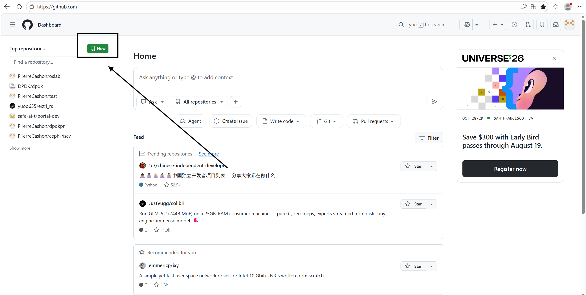
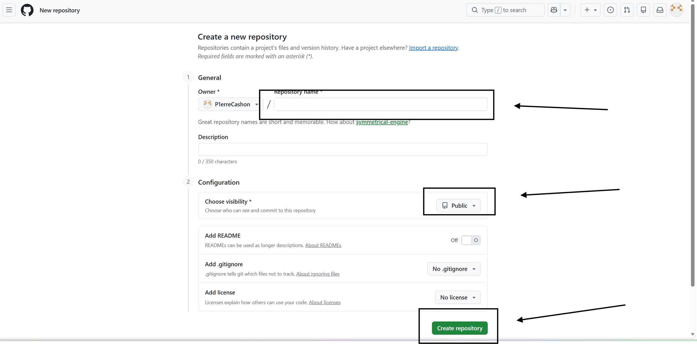
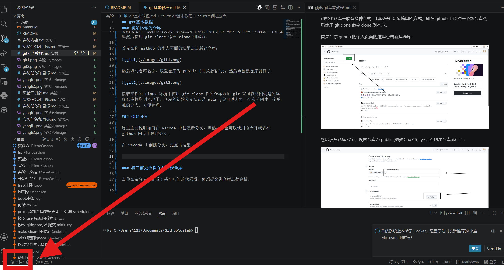
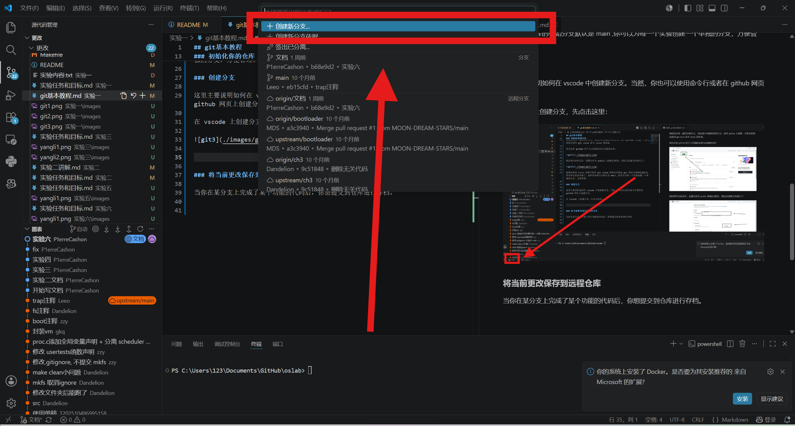
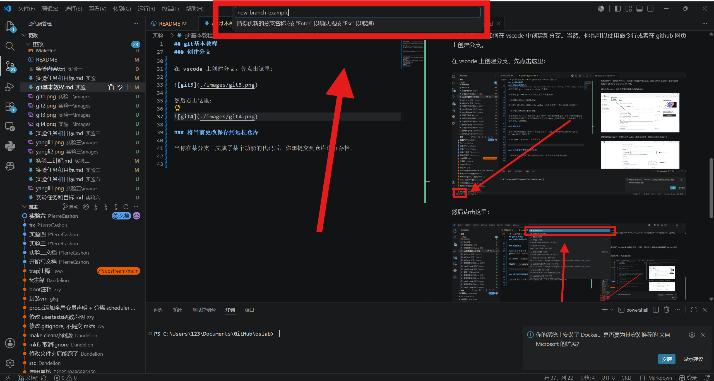
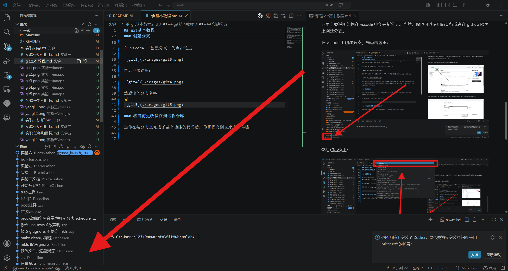
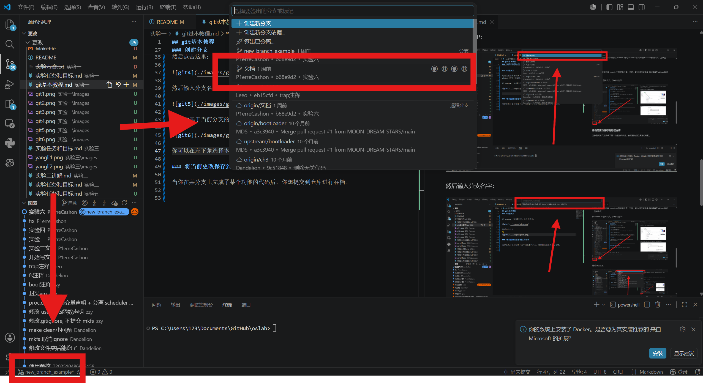
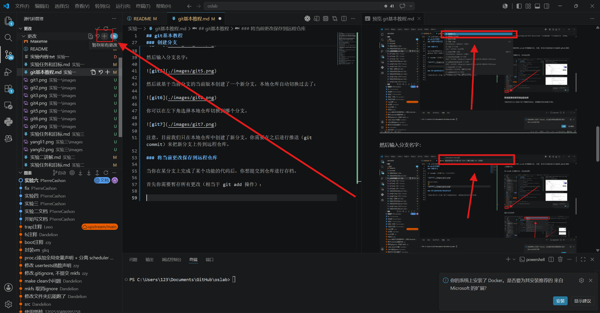

## git基本教程

在本实验中，你需要使用 git 版本控制工具管理你的仓库。如果你已经会用 git 了，就不用阅读此文档。

网上有很多关于 git 的教程。关于 git 命令的教程，你可以参考 https://nju-projectn.github.io/ics-pa-gitbook/ics2021/git.html 。注意，这个文档只有关于本地仓库的管理，关于远程仓库和本地仓库，你可以看一下下面我写的教程。

你可以在 https://learngitbranching.js.org/?locale=zh_CN 实操一下你刚刚学到的 git 命令。

好消息是，本实验中你只使用git clone 、 git add 、 git commit 、 git push 、 git pull 、 git branch 、 git checkout 这几个命令就能完成对仓库的管理了。你可以暂时不用考虑 git 的其他功能，如分支合并等。

考虑到很多同学会使用 vscode 开发，我这里提供一个 vscode 教程：

### 初始化你的仓库

初始化仓库一般有多种方式，我这里介绍最简单的方式，即在 github 上创建一个新仓库然后使用 git clone 命令 clone 到本地。

首先在你 github 的个人页面的这里点击新建仓库：

然后填写仓库名字，设置仓库为 public (助教会看的)，然后点创建仓库就行了：

接着在你的 Linux 环境中使用 git clone 你的仓库地址.git 就可以将刚创建的远程仓库拉取到本地了。仓库的初始分支默认是 main ,你可以为每一个实验创建一个单独的分支，方便管理。

### 创建分支

这里主要说明如何在 vscode 中创建新分支。当然，你也可以使用命令行或者在 github 网页上创建分支。

在 vscode 上创建分支，先点击这里：

然后点击这里：

然后输入分支名字：

然后就基于当前分支的当前版本创建了一个新分支，本地仓库自动切换过去了：

你可以在左下角选择本地仓库切换到哪个分支。

注意，目前我们只在本地仓库中创建了新分支。你需要在之后进行推送（git commit）来把新分支上传到远程仓库。

### 将当前更改保存到远程仓库

当你在某分支上完成了某个功能的代码后，你想提交到仓库进行存档。

首先你需要暂存所有更改（相当于 git add 操作）：

然后在这里填写你对这次 commit 的描述，然后点击提交，当前更改就保存（git commit）到了本地仓库：