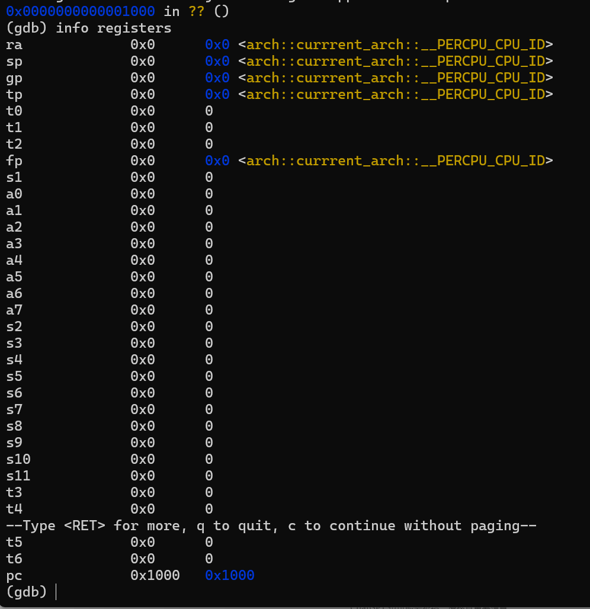
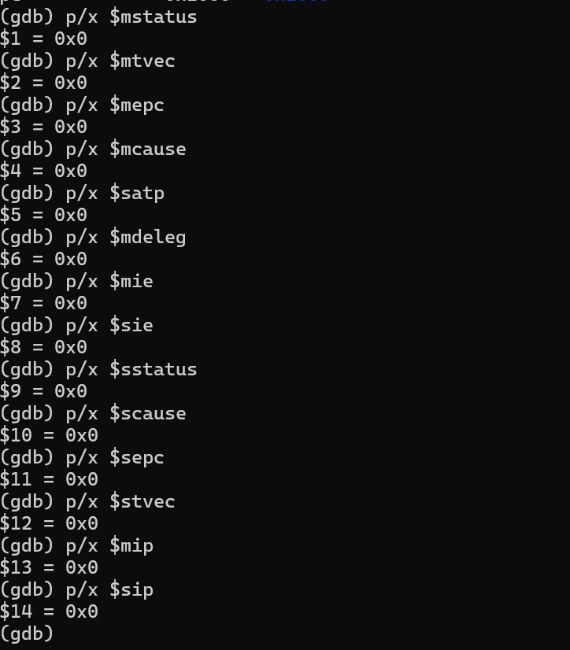
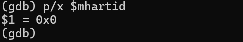

# QEMU使用指南

## 什么是QEMU

QEMU是一款开源的虚拟机软件，能够模拟多种不同的硬件平台，包括x86、ARM、RISC-V等。QEMU可用于虚拟化、仿真、调试和测试等多种应用场景，为用户提供了一个隔离的环境来运行不同的应用程序和操作系统。QEMU模拟器包含CPU 、物理内存以及若干 I/O 外设，用户可以通过启动命令调整QEMU的各项配置，比如CPU核数，包含哪些外设等。

## 为什么使用QEMU

本实验需要你实现一个运行在RISC-V架构上的操作系统，我们就需要有一个RISC-V裸机环境。

## 怎么使用QEMU

将你的内核编译之后，会产生一个可执行文件（也叫ELF文件）。假如你的内核可执行文件叫KERNEL_ELF，那么你就可以用以下指令启动QEMU并加载你的内核可执行文件开始运行。

bash
```
qemu-system-riscv64 \
  -machine virt -bios none -kernel KERNEL_ELF \
  -m 128M -smp 1 -nographic
```
其中，-machine virt表示将模拟的RISC-V 计算机设置为名为 virt 的虚拟计算机。-bios none表示不使用bios。-kernel KERNEL_ELF表示加载文件名为KERNEL_ELF的可执行文件作为内核。-m 128M表示使用大小为128M的物理内存（你们可以认为是内存条大小）。-smp 1表示使用单核CPU。-nographic表示模拟器只对外输出字符流，不提供图形界面。

后续实验中你会需要对这个指令进行扩展，让QEMU启动时包含PCI和块设备。

## QEMU启动状态 

QEMU启动后，使用gdb打印所有寄存器状态就可以查看QEMU启动时默认
的寄存器状态是什么样的。可以看到，除了pc是0x1000、mhartid寄存器的值
是当前的hartid,其他寄存器的初始值都是0。








## QEMU启动流程

在Qemu模拟的 virt 硬件平台上，物理内存的起始物理地址为 0x80000000 ，物理内存的默认大小为 128MiB ，它可以通过 -m 选项进行配置。如果使用默认配置的 128MiB 物理内存则对应的物理地址区间为 [0x80000000,0x88000000) 。如果使用上面给出的命令启动 Qemu ，那么在 Qemu 开始执行任何指令之前，首先把一个文件加载到 Qemu 的物理内存中：即作把内核镜像 KERNEL_ELF 加载到以物理地址 0x80000000 开头的区域上。

为什么加载到这个位置呢？这与 Qemu 模拟计算机加电启动后的运行流程有关。一般来说，计算机加电之后的启动流程可以分成若干个阶段，每个阶段均由一层软件或 固件 负责，每一层软件或固件的功能是进行它应当承担的初始化工作，并在此之后跳转到下一层软件或固件的入口地址，也就是将计算机的控制权移交给了下一层软件或固件。Qemu 模拟的启动流程则可以分为两个阶段：第一个阶段由固化在 Qemu 内的一小段汇编程序负责；第二个阶段由 内核 负责。

第一阶段：将必要的文件载入到 Qemu 物理内存之后，Qemu CPU 的程序计数器（PC, Program Counter）会被初始化为 0x1000 ，因此 Qemu 实际执行的第一条指令位于物理地址 0x1000 ，接下来它将执行寥寥数条指令并跳转到物理地址 0x80000000 对应的指令处并进入第二阶段。从后面的调试过程可以看出，该地址 0x80000000 被固化在 Qemu 中，作为 Qemu 的使用者，我们在不触及 Qemu 源代码的情况下无法进行更改。

第二阶段：由于 Qemu 的第一阶段固定跳转到 0x80000000 ，为了正确地和上一阶段的 QEMU 跳转对接，我们需要保证内核的第一条指令位于物理地址 0x80000000 处。为此，我们需要将内核镜像预先加载到 Qemu 物理内存以地址 0x80000000 开头的区域上。一旦 CPU 开始执行内核的第一条指令，证明计算机的控制权已经被移交给我们的内核，也就达到了本节的目标。
