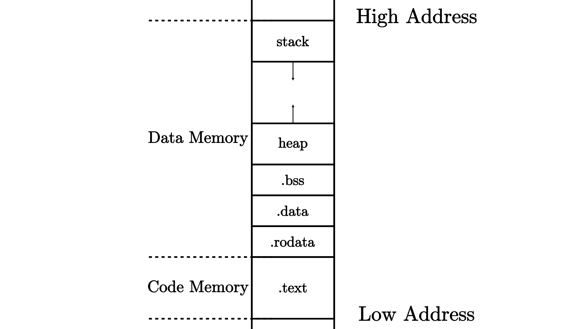
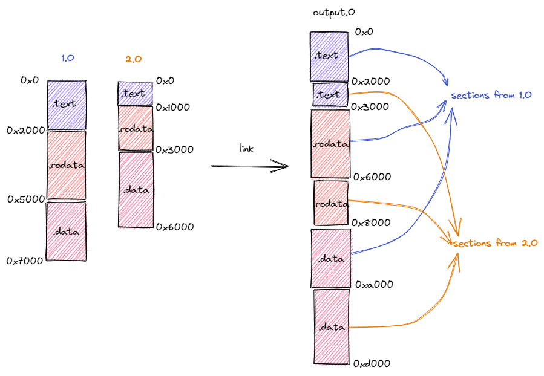
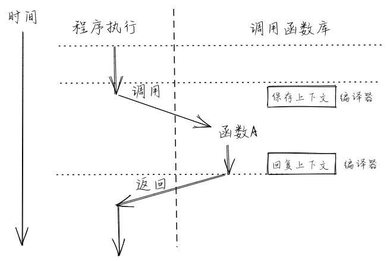
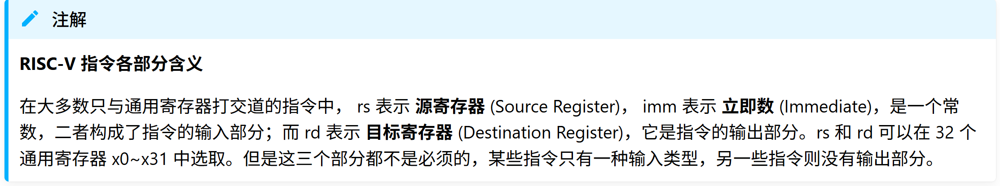
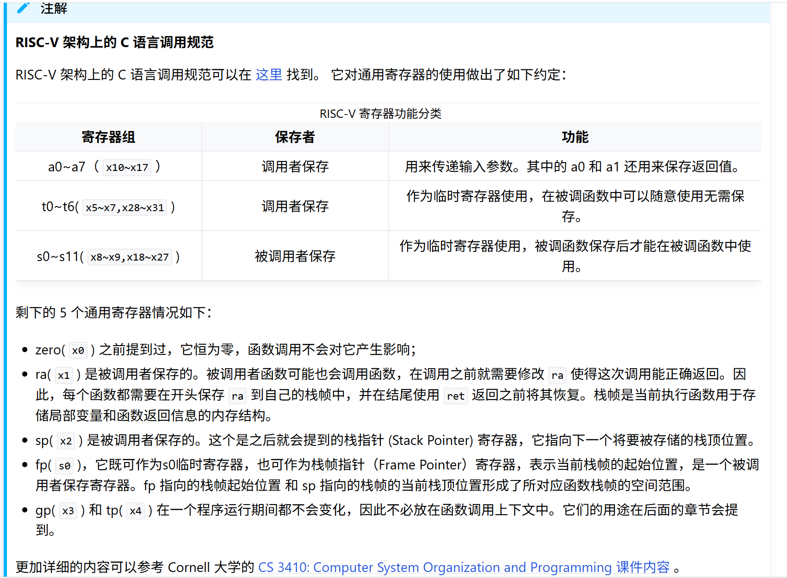
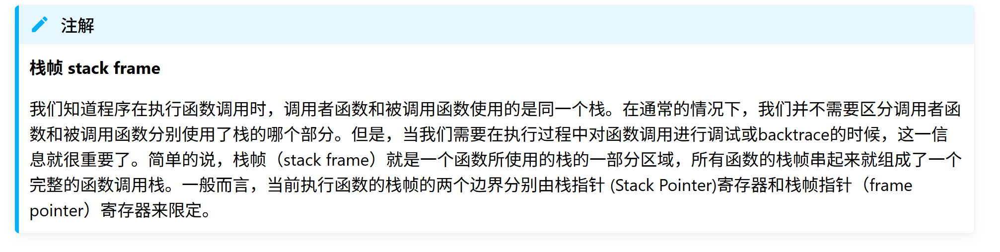
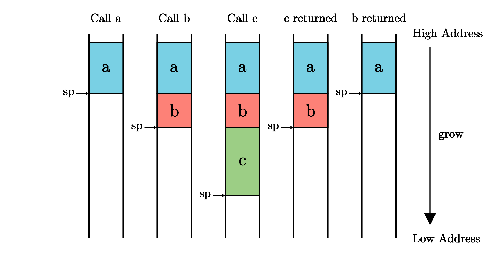
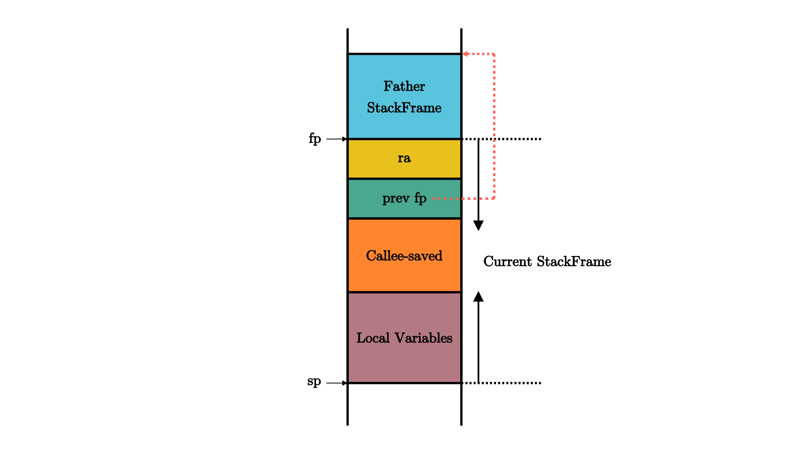

## 计算机组成基础
当编写应用程序的时候，大多数情况下我们只需调用库函数即可在操作系统的支持下实现各项功能，而无需关心操作系统如何调度管理各类软硬件资源。操作系统提供了一些监控工具（如 Windows 上的任务管理器或 Linux 上的 ps 工具），这些工具可以帮助我们统计 CPU、内存、硬盘、网络等资源的占用情况，从而让我们大致上了解这些资源的使用情况，并帮助我们更好地开发或部署应用程序。然而，在实际编写操作系统的时候，我们就必须直面这些硬件资源，将它们管理起来并为应用程序提供高效易用的抽象。为此，我们必须增进对于这些硬件的了解。

计算机主要由处理器（Processor，也即中央处理器，CPU，Central Processing Unit），物理内存和 I/O 外设三部分组成。处理器的主要功能是从物理内存中读取指令、译码并执行，在此过程中还要与物理内存和 I/O 外设打交道。物理内存则是计算机体系结构中一个重要的组成部分。在存储方面，CPU 唯一能够直接访问的只有物理内存中的数据，它可以通过访存指令来达到这一目的。从 CPU 的视角看来，可以将物理内存看成一个大字节数组，而物理地址则对应于一个能够用来访问数组中某个元素的下标。与我们日常编程习惯不同的是，该下标通常不以 0 开头，而通常以一个常数，如 0x80000000 开头。简言之，CPU 可以通过物理地址来寻址，并 **逐字节** 地访问物理内存中保存的数据。

值得一提的是，当 CPU 以多个字节（比如 2/4/8 或更多）为单位访问物理内存（事实上并不局限于物理内存，也包括I/O外设的数据空间）中的数据时，就有可能会引入端序（也称字节顺序）和内存地址对齐的问题。由于这并不是重点，我们在这里不展开说明。


## QEMU环境与Linux环境的区别

在本实验中，QEMU模拟器只提供一个裸机环境。因此，你写的程序需要面向裸机环境运行。

在本实验中最容易产生的误解是：既然都是“编译后运行”，为什么裸机程序还需要额外关心入口、地址和栈？

这是因为普通 Linux 用户态程序和裸机程序所处的运行环境完全不同。

### 1. 普通 Linux 用户态程序

对于普通程序，操作系统会负责：

1. 创建进程地址空间。
2. 把程序装载到合适的虚拟地址。
3. 初始化栈、堆和运行时环境。
4. 提供标准输入输出和系统调用接口。
5. 在程序退出后回收资源。

用户态程序通常只需要从 `main` 函数开始编写逻辑，而不需要自己关心程序最初是如何被放到内存中的。

### 2. 裸机程序 / 最小内核

在裸机环境中：

1. 没有现成的操作系统帮你装载程序。
2. 没有默认初始化好的栈。
3. 程序必须从指定入口地址开始执行。
4. 程序所放置的内存位置必须与 QEMU 或硬件平台的预期一致。

所以内核启动时首先面对的问题不是“算法如何写”，而是我的内核代码应该放到哪、如何初始化栈。


## 程序内存布局与编译流程
### 程序内存布局
在我们将源代码编译为可执行文件之后，它就会变成一个看似充满了杂乱无章的字节的一个文件。但我们知道这些字节至少可以分成代码和数据两部分，在程序运行起来的时候它们的功能并不相同：代码部分由一条条可以被 CPU 解码并执行的指令组成，而数据部分只是被 CPU 视作可读写的内存空间。事实上我们还可以根据其功能进一步把两个部分划分为更小的单位： **段** (Section) 。不同的段会被编译器放置在内存不同的位置上，这构成了程序的 **内存布局** (Memory Layout)。一种典型的程序相对内存布局如下所示：



<div style="text-align: center;">一种典型的程序相对内存布局</div>

在上图中可以看到，代码部分只有代码段 .text 一个段，存放程序的所有汇编代码。而数据部分则还可以继续细化：

已初始化数据段保存程序中那些已初始化的全局数据，分为 .rodata 和 .data 两部分。前者存放只读的全局数据，通常是一些常数或者是 常量字符串等；而后者存放可修改的全局数据。

未初始化数据段 .bss 保存程序中那些未初始化的全局数据，通常由程序的加载者代为进行零初始化，即将这块区域逐字节清零；

**·** **堆** （heap）区域用来存放程序运行时动态分配的数据，如 C/C++ 中的 malloc/new 分配到的数据本体就放在堆区域，它向高地址增长；

**·** **栈** （stack）区域不仅用作函数调用上下文的保存与恢复，每个函数作用域内的局部变量也被编译器放在它的栈帧内，它向低地址增长。


## 编译流程
从源代码得到可执行文件的编译流程可被细化为多个阶段（虽然输入一条命令便可将它们全部完成）：

1. **编译器** (Compiler) 将每个源文件从某门高级编程语言转化为汇编语言，注意此时源文件仍然是一个 ASCII 或其他编码的文本文件；

2. **汇编器** (Assembler) 将上一步的每个源文件中的文本格式的指令转化为机器码，得到一个二进制的 目标文件 (Object File)；

3. **链接器** (Linker) 将上一步得到的所有目标文件以及一些可能的外部目标文件链接在一起形成一个完整的可执行文件。

汇编器输出的每个目标文件都有一个独立的程序内存布局，它描述了目标文件内各段所在的位置。而链接器所做的事情是将所有输入的目标文件整合成一个整体的内存布局。在此期间链接器主要完成两件事情：
> 第一件事情是将来自不同目标文件的段在目标内存布局中重新排布。如下图所示，在链接过程中，分别来自于目标文件 1.o 和 2.o 段被按照段的功能进行分类，相同功能的段被排在一起放在拼装后的目标文件 output.o 中。注意到，目标文件 1.o 和 2.o 的内存布局是存在冲突的，同一个地址在不同的内存布局中存放不同的内容。而在合并后的内存布局中，这些冲突被消除。
>



<div style="text-align: center;">来自不同目标文件的段的重新排布</div>

>第二件事情是将符号替换为具体地址。这里的符号指什么呢？我们知道，在我们进行模块化编程的时候，每个模块都会提供一些向其他模块公开的全局变量、函数等供其他模块访问，也会访问其他模块向它公开的内容。要访问一个变量或者调用一个函数，在源代码级别我们只需知道它们的名字即可，这些名字被我们称为符号。取决于符号来自于模块内部还是其他模块，我们还可以进一步将符号分成内部符号和外部符号。然而，在机器码级别（也即在目标文件或可执行文件中）我们并不是通过符号来找到索引我们想要访问的变量或函数，而是直接通过变量或函数的地址。例如，如果想调用一个函数，那么在指令的机器码中我们可以找到函数入口的绝对地址或者相对于当前 PC 的相对地址。
>
>那么，符号何时被替换为具体地址呢？因为符号对应的变量或函数都是放在某个段里面的固定位置（如全局变量往往放在 .bss 或者 .data 段中，而函数则放在 .text 段中），所以我们需要等待符号所在的段确定了它们在内存布局中的位置之后才能知道它们确切的地址。当一个模块被转化为目标文件之后，它的内部符号就已经在目标文件中被转化为具体的地址了，因为目标文件给出了模块的内存布局，也就意味着模块内的各个段的位置已经被确定了。然而，此时模块所用到的外部符号的地址无法确定。我们需要将这些外部符号记录下来，放在目标文件一个名为符号表（Symbol table）的区域内。由于后续可能还需要重定位，内部符号也同样需要被记录在符号表中。
>
>外部符号需要等到链接的时候才能被转化为具体地址。假设模块 1 用到了模块 2 提供的内容，当两个模块的目标文件链接到一起的时候，它们的内存布局会被合并，也就意味着两个模块的各个段的位置均被确定下来。此时，模块 1 用到的来自模块 2 的外部符号可以被转化为具体地址。同时我们还需要注意：两个模块的段在合并后的内存布局中被重新排布，其最终的位置有可能和它们在模块自身的局部内存布局中的位置相比已经发生了变化。因此，每个模块的内部符号的地址也有可能会发生变化，我们也需要进行修正。上面的过程被称为重定位（Relocation），这个过程形象一些来说很像拼图：由于模块 1 用到了模块 2 的内容，因此二者分别相当于一块凹进和凸出一部分的拼图，正因如此我们可以将它们无缝地拼接到一起。
>

上面我们简单介绍了程序内存布局和编译流程特别是链接过程的相关知识。那么如何得到一个能够在 Qemu 上成功运行的内核镜像呢？首先我们需要通过链接脚本调整内核可执行文件的内存布局，使得内核被执行的第一条指令位于地址 0x80000000 处，同时代码段所在的地址应低于其他段。这是因为 Qemu 物理内存中低于 0x80000000 的区域并未分配给内核。下一节我们将成功生成内核镜像并在 Qemu 上验证控制权被转移到内核。


## 函数调用与栈
从汇编指令的级别看待一段程序的执行，假如 CPU 依次执行的指令的物理地址序列为 {$a_n$}，那么这个序列会符合怎样的模式呢？

其中最简单的无疑就是 CPU 一条条连续向下执行指令，也即满足递推公式 $a_{n+1}$=$a_{n+L}$，这里我们假设该平台的指令是定长的且均为 L 字节（常见情况为 2/4 字节）。但是执行序列并不总是符合这种模式，当位于物理地址 $a_n$ 的指令是一条跳转指令的时候，该模式就有可能被破坏。跳转指令对应于我们在程序中构造的 **控制流** (Control Flow) 的多种不同结构，比如分支结构（如 if/switch 语句）和循环结构（如 for/while 语句）。用来实现上述两种结构的跳转指令，只需实现跳转功能，也就是将 pc 寄存器设置到一个指定的地址即可。

另一种控制流结构则显得更为复杂： **函数调用** (Function Call)。我们大概清楚调用函数整个过程中代码执行的顺序，如果是从源代码级的视角来看，我们会去执行被调用函数的代码，等到它返回之后，我们会回到调用函数对应语句的下一行继续执行。那么我们如何用汇编指令来实现这一过程？首先在调用的时候，需要有一条指令跳转到被调用函数的位置，这个看起来和其他控制结构没什么不同；但是在被调用函数返回的时候，我们却需要返回那条跳转过来的指令的下一条继续执行。这次用来返回的跳转究竟跳转到何处，在对应的函数调用发生之前是不知道的。比如，我们在两个不同的地方调用同一个函数，显然函数返回之后会回到不同的地址。这是一个很大的不同：其他控制流都只需要跳转到一个 编译期固定下来 的地址，而函数调用的返回跳转是跳转到一个 运行时确定 （确切地说是在函数调用发生的时候）的地址。



对此，指令集必须给用于函数调用的跳转指令一些额外的能力，而不只是单纯的跳转。在 RISC-V 架构上，有两条指令即符合这样的特征：

RISC-V 函数调用跳转指令
指令

| 指令 | 功能 |
|------|------|
| $\text{jal}\ \text{rd},\ \text{imm}[20:1]$ | $\text{rd} \leftarrow \text{pc} + 4$<br>$\text{pc} \leftarrow \text{pc} + \text{imm}$ |
| $\text{jalr}\ \text{rd},\ (\text{imm}[11:0])\text{rs}$ | $\text{rd} \leftarrow \text{pc} + 4$<br>$\text{pc} \leftarrow \text{rs} + \text{imm}$ |



从中可以看出，这两条指令在设置 pc 寄存器完成跳转功能之前，还将当前跳转指令的下一条指令地址保存在 rd 寄存器中，即 $\text{rd} \leftarrow \text{pc} + 4$ 这条指令的含义。（这里假设所有指令的长度均为 4 字节）在 RISC-V 架构中，通常使用 ra 寄存器（即 x1 寄存器）作为其中的 rd 对应的具体寄存器，因此在函数返回的时候，只需跳转回 ra 所保存的地址即可。事实上在函数返回的时候我们常常使用一条 **汇编伪指令** (Pseudo Instruction) 跳转回调用之前的位置： ret 。它会被汇编器翻译为 jalr x0, 0(x1)，含义为跳转到寄存器 ra 保存的物理地址，由于 x0 是一个恒为 0 的寄存器，在 rd 中保存这一步被省略。

总结一下，在进行函数调用的时候，我们通过 jalr 指令保存返回地址并实现跳转；而在函数即将返回的时候，则通过 ret 伪指令回到跳转之前的下一条指令继续执行。这样，RISC-V 的这两条指令就实现了函数调用流程的核心机制。

由于我们是在 ra 寄存器中保存返回地址的，我们要保证它在函数执行的全程不发生变化，不然在 ret 之后就会跳转到错误的位置。事实上编译器除了函数调用的相关指令之外确实基本上不使用 ra 寄存器。也就是说，如果在函数中没有调用其他函数，那 ra 的值不会变化，函数调用流程能够正常工作。但遗憾的是，在实际编写代码的时候我们常常会遇到函数 **多层嵌套调用** 的情形。我们很容易想象，如果函数不支持嵌套调用，那么编程将会变得多么复杂。如果我们试图在一个函数 \(f\) 中调用一个子函数，在跳转到子函数 \(g\) 的同时，ra 会被覆盖成这条跳转指令的下一条的地址，而 ra 之前所保存的函数 \(f\) 的返回地址将会 永久丢失 。

因此，若想正确实现嵌套函数调用的控制流，我们必须通过某种方式保证：在一个函数调用子函数的前后，ra 寄存器的值不能发生变化。但实际上，这并不仅仅局限于 ra 一个寄存器，而是作用于所有的通用寄存器。这是因为，编译器是独立编译每个函数的，因此一个函数并不能知道它所调用的子函数修改了哪些寄存器。而站在一个函数的视角，在调用子函数的过程中某些寄存器的值被覆盖的确会对它接下来的执行产生影响。因此这是必要的。我们将由于函数调用，在控制流转移前后需要保持不变的寄存器集合称之为 **函数调用上下文** (Function Call Context) 。

由于每个 CPU 只有一套寄存器，我们若想在子函数调用前后保持函数调用上下文不变，就需要物理内存的帮助。确切的说，在调用子函数之前，我们需要在物理内存中的一个区域 **保存** (Save) 函数调用上下文中的寄存器；而在函数执行完毕后，我们会从内存中同样的区域读取并 **恢复** (Restore) 函数调用上下文中的寄存器。实际上，这一工作是由子函数的调用者和被调用者（也就是子函数自身）合作完成。函数调用上下文中的寄存器被分为如下两类：

**·** **被调用者保存(Callee-Saved) 寄存器** ：被调用的函数可能会覆盖这些寄存器，需要被调用的函数来保存的寄存器，即由被调用的函数来保证在调用前后，这些寄存器保持不变；

**·** **调用者保存(Caller-Saved) 寄存器** ：被调用的函数可能会覆盖这些寄存器，需要发起调用的函数来保存的寄存器，即由发起调用的函数来保证在调用前后，这些寄存器保持不变。

从名字中可以看出，函数调用上下文由调用者和被调用者分别保存，其具体过程分别如下：

调用函数：首先保存不希望在函数调用过程中发生变化的 **调用者保存寄存器** ，然后通过 jal/jalr 指令调用子函数，返回之后恢复这些寄存器。

被调用函数：在被调用函数的起始，先保存函数执行过程中被用到的 **被调用者保存寄存器** ，然后执行函数，最后在函数退出之前恢复这些寄存器。

我们发现无论是调用函数还是被调用函数，都会因调用行为而需要两段匹配的保存和恢复寄存器的汇编代码，可以分别将其称为 **开场** (Prologue) 和 **结尾** (Epilogue)，它们会由编译器帮我们自动插入，来完成相关寄存器的保存与恢复。一个函数既有可能作为调用者调用其他函数，也有可能作为被调用者被其他函数调用。

## 调用规范
**调用规范** (Calling Convention) 约定在某个指令集架构上，某种编程语言的函数调用如何实现。它包括了以下内容：

函数的输入参数和返回值如何传递；

函数调用上下文中调用者/被调用者保存寄存器的划分；

其他的在函数调用流程中对于寄存器的使用方法。

调用规范是对于一种确定的编程语言来说的，因为一般意义上的函数调用只会在编程语言的内部进行。当一种语言想要调用用另一门编程语言编写的函数接口时，编译器就需要同时清楚两门语言的调用规范，并对寄存器的使用做出调整。



之前我们讨论了函数调用上下文的保存/恢复时机以及寄存器的选择，但我们并没有详细说明这些寄存器保存在哪里，只是用“内存中的一块区域”草草带过。实际上，它更确切的名字是 **栈** (Stack) 。 sp 寄存器常用来保存 **栈指针** (Stack Pointer)，它指向内存中栈顶地址。在 RISC-V 架构中，栈是从高地址向低地址增长的。在一个函数中，作为起始的开场代码负责分配一块新的栈空间，即将 sp 的值减小相应的字节数即可，于是物理地址区间 \([\text{新sp},\text{旧sp})\) 对应的物理内存的一部分便可以被这个函数用来进行函数调用上下文的保存/恢复，这块物理内存被称为这个函数的 **栈帧** (Stack Frame)。同理，函数中的结尾代码负责将开场代码分配的栈帧回收，这也仅仅需要将 sp 的值增加相同的字节数回到分配之前的状态。这也可以解释为什么 sp 是一个被调用者保存寄存器。





函数调用与栈帧：如图所示，我们能够看到在程序依次调用 a、调用 b、调用 c、c 返回、b 返回整个过程中栈帧的分配/回收以及 sp 寄存器的变化。 图中标有 a/b/c 的块分别代表函数 a/b/c 的栈帧。


在合适的编译选项设置之下，一个函数的栈帧内容可能如下图所示：



<div style="text-align: center;">函数栈帧中的内容</div>

它的开头和结尾分别在 sp(x2) 和 fp(s0) 所指向的地址。按照地址从高到低分别有以下内容，它们都是通过 sp 加上一个偏移量来访问的：

**·** ra 寄存器保存其返回之后的跳转地址，是一个被调用者保存寄存器；

**·** 父亲栈帧的结束地址 fp ，是一个被调用者保存寄存器；

**·** 其他被调用者保存寄存器 s1 ~ s11 ；

**·** 函数所使用到的局部变量。

因此，栈上多个 fp 信息实际上保存了一条完整的函数调用链，通过适当的方式我们可以实现对函数调用关系的跟踪。

ra 、 sp 和 fp 是和函数调用紧密相关的寄存器，我们用一个例子来展示真实编译器生成的汇编代码会如何使用这些寄存器。首先，无论对于内核本身还是第二章后出现的应用程序，我们可以使用 rust 编程语言，设置我们的默认编译目标，同时调整编译选项，设置链接脚本以及强制打开 fp 选项，这样才会避免 fp 相关指令被编译器优化掉。随后，我们可以使用 rust-objdump 工具反汇编内核或者应用程序可执行文件，并找到某个函数的入口。然后，我们能够看到在函数的开场和结尾阶段，编译器会生成类似的汇编代码：


```
# 开场
# 为当前函数分配 64 字节的栈帧
addi        sp, sp, -64
# 将 ra 和 fp 压栈保存
sd  ra, 56(sp)
sd  s0, 48(sp)
# 更新 fp 为当前函数栈帧顶端地址
addi        s0, sp, 64

# 函数执行
# 中间如果再调用了其他函数会修改 ra

# 结尾
# 恢复 ra 和 fp
ld  ra, 56(sp)
ld  s0, 48(sp)
# 退栈
addi        sp, sp, 64
# 返回，使用 ret 指令或其他等价的实现方式
ret
```

至此，我们基本上说明了函数调用是如何基于栈来实现的。不过我们可以暂时先忽略掉这些细节，因为我们现在只是需要在初始化阶段完成栈的设置，也就是设置好栈指针 sp 寄存器，编译器会帮我们自动完成后面的函数调用相关机制的代码生成。麻烦的是， sp 的值也不能随便设置，至少我们需要保证它指向合法的物理内存，而且不能与程序的其他代码、数据段相交，因为在函数调用的过程中，栈区域里面的内容会被修改。如何保证这一点呢？

## 分配并使用启动栈
我们需要在仓库中创建 entry.S 文件，并在entry.S中使用RISC-V汇编分配启动栈空间，并在控制权被转交给 C 入口之前将栈指针 sp 设置为栈顶的位置。

我们还需要在内核的 C 入口start.c中预留了一块大小为 4096 * NCPU 字节用作接下来要运行的程序的栈空间。这里我们将 CPU_stack 定义为一个全局变量，它会被编译器放到 .bss 段中。

```
#entry.S
.section .text
_entry:
1        # CPU_stack 定义于start.c中
2        # 将sp置于当前CPU的内核栈的栈顶
3        la sp, CPU_stack
4        li a0, 4096
5        csrr a1, mhartid
6        addi a1, a1, 1
7        mul a0, a0, a1
8        add sp, sp, a0
9        # 跳转到start
10       call start
spin:
        j spin


#start.c

__attribute__ ((aligned (16))) uint8 CPU_stack[4096 * NCPU];
```
前面我们提到过 .bss 段一般放置需要被初始化为零的数据。然而栈并不需要在使用前被初始化为零，因为在函数调用的时候我们会插入栈帧覆盖已有的数据。

回到 entry.S ，可以发现在控制权转交给 C 入口之前会执行几条指令，它们分别位于 entry.S 的第 3-8 行。这几行我们将栈指针 sp 设置为先前分配的启动栈栈顶地址，这样 C 代码在进行函数调用和返回的时候就可以正常在启动栈上分配和回收栈帧了。在我们设计好的内存布局中，这块启动栈所用的内存并不会和内核的其他代码、数据段产生冲突，它们是从物理上隔离的。然而如果启动栈溢出（比如在内核代码中出现了太多的函数调用），那么分配的栈帧将有可能覆盖内核其他部分的代码、数据从而出现十分诡异的错误。目前我们只能尽量避免栈溢出的情况发生，第 10 行我们通过伪指令 call 调用 C 编写的内核入口点 start 将控制权转交给 C 代码，该入口点在 start.c 中实现：

```
// start.c完整内容
#include "riscv.h"

__attribute__ ((aligned (16))) uint8 CPU_stack[4096 * NCPU];

// 前向声明
void main();

void start()
{
    // 设置页表项为0，禁止分页
    w_satp(0);

    // 设置PMP地址寄存器0
    // 设置PMP配置寄存器0
    unsigned long x = r_mstatus();
    x &= ~MSTATUS_MPP_MASK;
    x |= MSTATUS_MPP_S;
    w_mstatus(x);

    // 把mepc设为main函数的地址
    w_mepc((uint64)main);

    // 关闭所有中断和异常，从而使得
    // w_medeleg(0xffff);
    // w_mideleg(0xffff);
    // w_sie(r_sie() | SIE_SEIE | SIE_STIE | SIE_SSIE);

    // 物理内存设置，从而设置到S模式
    // 能够访问所有物理内存
    w_pmpaddr0(0x3fffffffffffffull);
    w_pmpcfg0(0xf);

    // 将每个CPU的hartid存放在寄存器中，从而供cpuid()使用
    int id = r_mhartid();
    w_tp(id);

    // 启用mret，跳转到main
    asm volatile("mret");
}
```

QEMU模拟器启动后，机器的默认状态为 Machine 态。在 start.c 中，我们需要给一些只有 Machine 态才有权限访问的寄存器设置好值再进入 Supervisor 态。由于这里涉及到机器状态的切换，我们需要设置 mepc 寄存器并使用指令 mret 跳转到 Supervisor 态。