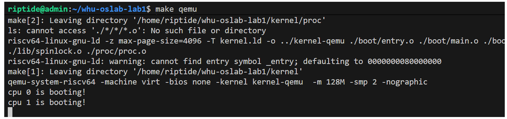

## 实验任务和⽬标
本实验任务如下:
1. 通过参考 xv6 的启动机制，理解并实现最⼩操作系统的引导过程，实现操作系统的启动。
2. 学习在 xv6 操作系统中如何使⽤串⼝驱动uart，从⽽在QEMU中输出对应启动信息，最终在QEMU中输出测试信息。
3. 额外任务:通过测试代码理解锁的⽤处（仅理解就行），从⽽理解操作系统中锁的作⽤，加强进程与线程中有关于锁的印象。

## 运行测试

本实验中你只需要在你的系统启动后输出一个 printf 就可以了。类似这样：
```
void main()
{
    int cpuid = mycpuid();
    if(cpuid == 0){
        print_init();
        printf("cpu %d is booting!\n", cpuid);
        __sync_synchronize();
        started = 1;
        
        printf("cpu %d report: The first sentence\n", cpuid);
        
    }
    else{
        while(started == 0) {};
        __sync_synchronize();
        printf("cpu %d is booting!\n", cpuid);
        
        printf("cpu %d report: The another sentence\n", cpuid);
        
    }

    while(1){};
}
```

由于我们要在本实验中初步认识锁，你需要在本实验中将 QEMU 的启动参数 smp 设置为 2 来开启两个核。在后续的实验中我们仅会使用单核，你需要在后续实验中注意一下 QEMU 的 smp 参数是否都为 1 。

你可以参考这个示例输出：

