## 遇到问题如何解决

在本门课程中，你在实现系统时可能遇到各种奇怪的问题，比如：

**·** 系统启动之后没有输出

**·** 在后面的 trap 实验中触发了一个无限循环的 trap

**·** 从内核 trap 返回时不知道跳到了什么地方

由于我们的实验基本上就是一步一步复现 xv6 ，最简单的解决问题的方式就是对着 xv6 对应部分代码检查一下你自己的代码有哪里不一样。

在往年课程中，有同学尝试将问题丢给网页版聊天 AI （如 chatgpt 网页版）尝试解决问题。从最终结果来看这些网页版 AI 往往都搞不清楚问题的根源，只能给你一个编造的回答。

你也可以使用 codex 等工具解决问题。它们应该比网页版 AI 要靠谱得多。当然，你在提问时要让他知道我们的实验是基于 2019 版 xv6 设计的，不然它可能基于新版 xv6 给你一个错误的结果。

**最重要的是**，你在使用 AI 辅助编码时一定要审查一下 AI 给你的代码，最好不要一眼代码都不看就全部按照 AI 说的来改。当你的代码的实现方式和 xv6 有较大出入时即使是助教来修也要花费很多功夫的。

## 遇到难以解决的问题时怎么办

在后面的 trap 实现中，你有可能遇到上述的奇怪的难以解决的问题，有可能这些问题 AI 也无法解决。这时候我们还有最后的调试手段，就是使用 GDB （当然了，你也可以问助教，不过助教来也很有可能是使用 GDB）。

### 以 xv6 为例，如何启动gdb

1、在xv6-riscv目录下，执行make qemu-gdb：

```
make qemu-gdb
```
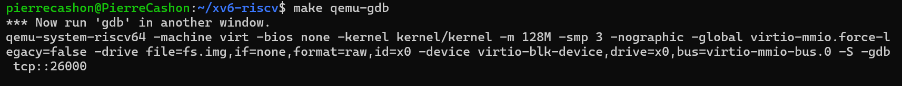

2、打开另一个控制台：

我们把新起的控制台叫控制台2

3、在控制台2进入xv6-riscv/kernel目录,并在控制台2执行gdb：

```
cd xv6-riscv/kernel

gdb-multiarch ./kernel
```
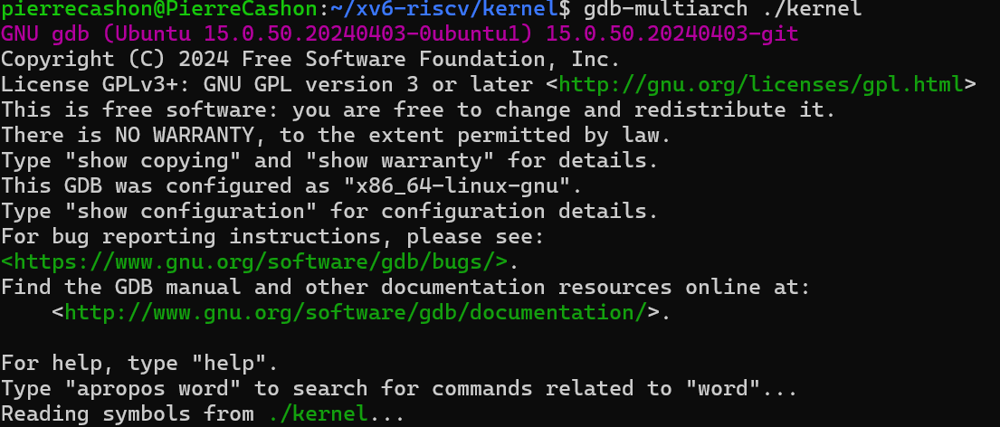

4、在控制台2的gdb中建立与控制台1的qemu的远程连接（这里的端口号要和控制台1启动gdb server时一致）：

```
(gdb)target remote :26000
```
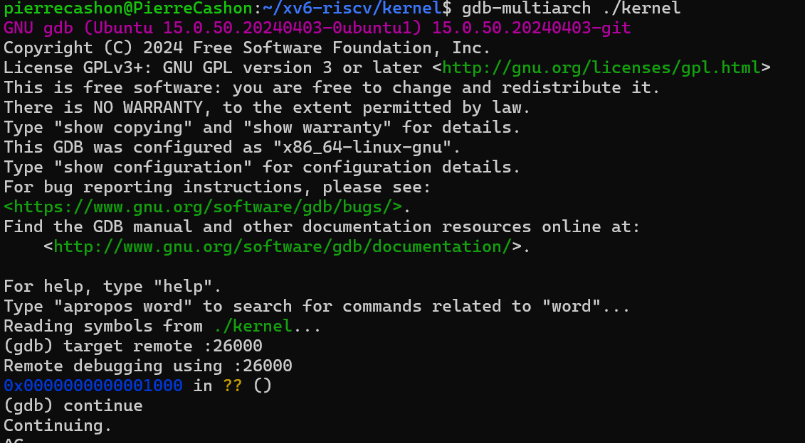

这样你就启动了 gdb server 和 gdb client。

### gdb调试指令及思路

我们调试主要是为了查看程序的执行过程以及执行过程中的某些寄存器值，变量值是否正确。为了达成这一目的，我们就需要在某些地方打断点，进行单步调试，打印某些变量值或者寄存器值。

以调试用户 trap 流程为例，我们可以在 usertrapret 函数打断点。你可以使用函数名打断点或者在某个 .c 文件的某一行打断点：

```
#在函数上打断点
b 函数名

#在文件中某一行打断点

b 文件名.c:行号

# 查看所有断点
info breakpoints

# 删除断点
delete 1  # 删除编号为1的断点
```

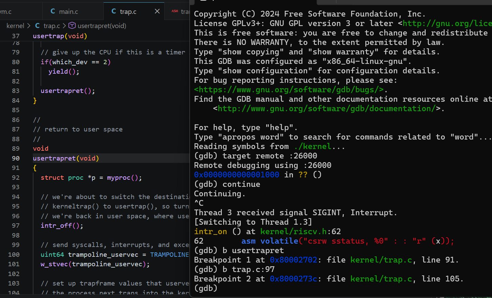

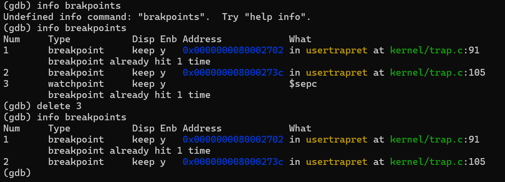

打完断点后，输入 c （continue）让程序运行直到遇到断点：

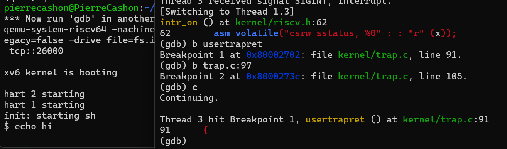

常用的打印某些变量值或者寄存器值的命令：

```
#打印接下来会执行的 n 条汇编指令
x/ni $pc

# 打印变量值
p variable_name

# 从指定地址开始，读取 8 个字节（64位）的数据，并以十六进制形式打印出来

x/gx variable_name

x/gx addr

```
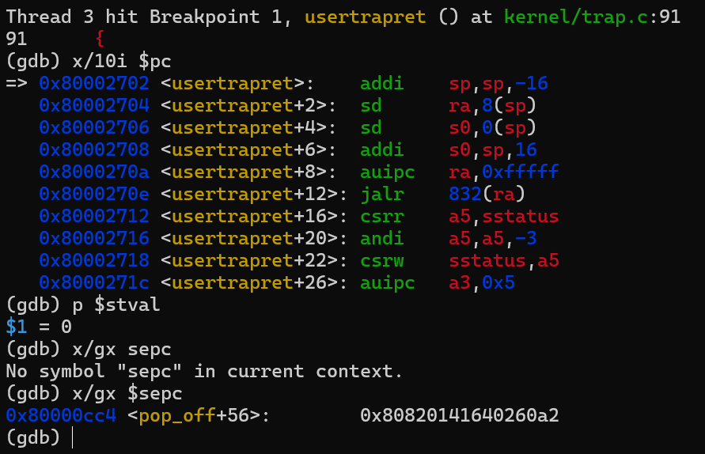


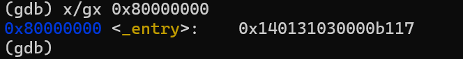

单步执行的命令：

```
# 单步执行下一条汇编（进入函数）
s

# 单步执行下一条汇编（不进入函数）
n
```

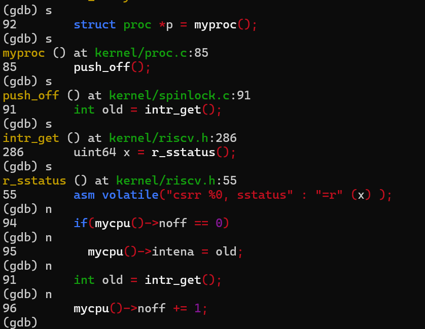

观察点：

```
# 当变量被修改时暂停
watch variable_name
```

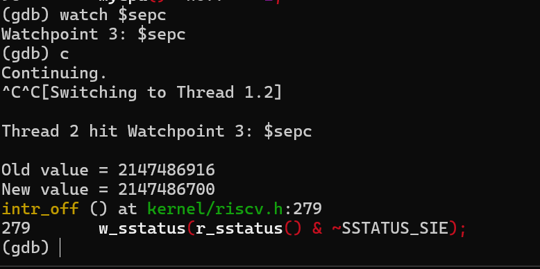


查看调用栈:
```
backtrace
# 简写
bt
```

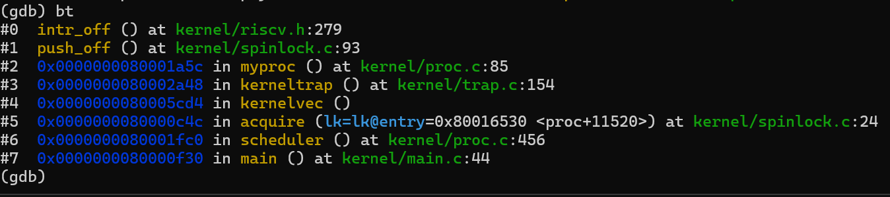

退出gdb:

```
quit
```
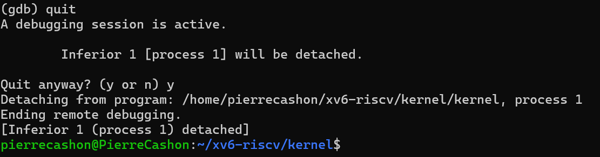

gdb常用的命令基本就这些了，想要熟练掌握gdb还是得靠多多使用。