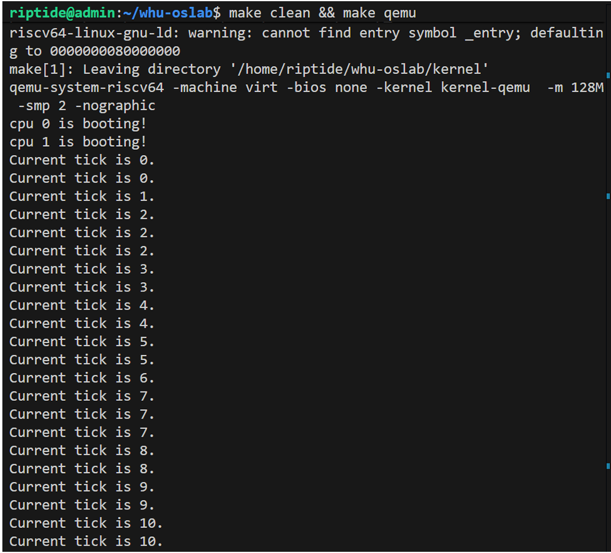
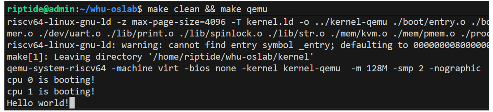

## 实验任务和⽬标
本实验主要通过分析xv6的中断处理机制，理解操作系统如何响应硬件事件，并实现如下⽬标:
1. 实现完整的操作系统中断处理框架，使得操作系统能够正确响应外部事件。
2. 实现xv6的时钟中断响应，使得xv6能够在引发时钟中断时输出信息（如当前计时器的ticks值）。
3. 实现xv6的外部中断响应，并通过CLINT，PLIC，uart使得xv6能够进⾏输⼊输出。

## 运行测试

本实验中你需要运行以下测试。你使用的测试代码不用完全和下面的代码一样，你只用确保测试内容包括下面这些就可以了。考虑到你还要写实验报告，你的测试代码最好有相应中间过程输出，用来证明你完成了这个实验。

### 1.时钟中断测试

为了测试时钟中断是否能够及时响应，在时钟中断当中增加⼀个输出语句，每次启⽤时钟中断时，将会输出当前timer的ticks数⽬。类似以下代码：

```
void timer_interrupt_handler()
{ 
// 输出当前ticks的测试代码部分 
int ticks = timer_get_ticks(); 
printf("Current tick is %d.\n", ticks); 
// 其他部分保持不变 
}
```

你可以参考这个样例输出：



### 2.外部中断测试
为了测试当前是否满足外部中断，由于外设已经连接上 uart ，所以在中断查看当前是否已经满足了输⼊的显示即可。启动操作系统之后，尝试在键盘上输⼊字符。

你可以参考这个样例输出：

