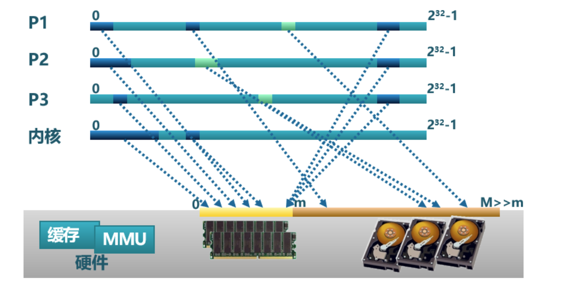
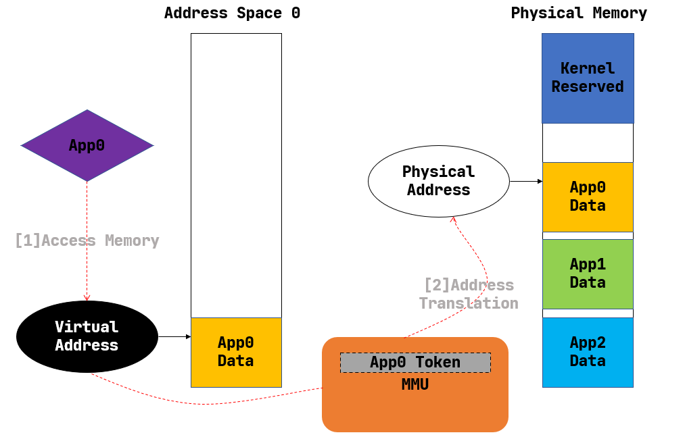

## 地址空间
直到现在，我们的操作系统给应用看到的是一个非常原始的物理内存空间，可以简单地理解为一个可以随便访问的大数组。为了限制应用访问内存空间的范围并给操作系统提供内存管理的灵活性，计算机硬件引入了各种内存保护/映射/地址转换硬件机制，如 RISC-V 的基址-边界翻译和保护机制、x86 的分段机制、RISC-V/x86/ARM 都有的分页机制。如果在地址转换过程中，无法找到物理地址或访问权限有误，则处理器产生非法访问内存的异常错误。

为了发挥上述硬件机制的能力，操作系统也需要升级自己的能力，更好地管理物理内存和虚拟内存，并给应用程序提供统一的虚拟内存访问接口。计算机科学家观察到这些不同硬件中的共同之处，即 CPU 访问数据和指令的内存地址是虚地址，通过硬件机制（比如 MMU +页表查询）进行地址转换，找到对应的物理地址。为此，计算机科学家提出了 地址空间（Address Space） 抽象，并在内核中建立虚实地址空间的映射机制，给应用程序提供一个基于地址空间的安全虚拟内存环境，让应用程序简单灵活地使用内存。

本节将结合操作系统的发展历程回顾来介绍地址空间抽象的实现策略是如何变化的。

## 虚拟地址与地址空间
### 地址虚拟化出现之前
我们之前介绍过，在远古计算机时代，整个硬件资源只用来执行单个裸机应用的时候，并不存在真正意义上的操作系统，而只能算是一种应用函数库。那个时候，物理内存的一部分用来保存函数库的代码和数据，余下的部分都交给应用来使用。从功能上可以将应用占据的内存分成几个段：代码段、全局数据段、堆和栈等。当然，由于就只有这一个应用，它想如何调整布局都是它自己的事情。从内存使用的角度来看，批处理系统和裸机应用很相似：批处理系统的每个应用也都是独占内核之外的全部内存空间，只不过当一个应用出错或退出之后，它所占据的内存区域会被清空，而应用序列中的下一个应用将自己的代码和数据放置进来。这个时期，内核提供给应用的访存视角是一致的，因为它们确实会在运行过程中始终独占一块固定的内存区域，每个应用开发者都基于这一认知来规划程序的内存布局。

后来，为了降低等待 I/O 带来的无意义的 CPU 资源损耗，多道程序出现了。而为了提升用户的交互式体验，提高生产力，分时多任务系统诞生了。它们的特点在于：应用开始多出了一种“暂停”状态，这可能来源于它主动 yield 交出 CPU 资源，或是在执行了足够长时间之后被内核强制性放弃处理器。当应用处于暂停状态的时候，它驻留在内存中的代码、数据该何去何从呢？曾经有一种省内存的做法是每个应用仍然和在批处理系统中一样独占内核之外的整块内存，当暂停的时候，内核负责将它的代码、数据保存在外存（如硬盘）中，然后把即将换入的应用在外存上的代码、数据恢复到内存，这些都做完之后才能开始执行新的应用。

不过，由于这种做法需要大量读写外部存储设备，而它们的速度都比 CPU 慢上几个数量级，这导致任务切换的开销过大，甚至完全不能接受。既然如此，就只能像我们在第三章中的做法一样，限制每个应用的最大可用内存空间小于物理内存的容量，这样就可以同时把多个应用的数据驻留在内存中。在任务切换的时候只需完成任务上下文保存与恢复即可，这只是在内存的帮助下保存、恢复少量通用寄存器，甚至无需访问外存，这从很大程度上降低了任务切换的开销。

在本章的引言中介绍过第三章中操作系统的做法对应用程序开发带了一定的困难。从应用开发的角度看，需要应用程序决定自己会被加载到哪个物理地址运行，需要直接访问真实的物理内存。这就要求应用开发者对于硬件的特性和使用方法有更多了解，产生额外的学习成本，也会为应用的开发和调试带来不便。从内核的角度来看，将直接访问物理内存的权力下放到应用会使得它难以对应用程序的访存行为进行有效管理，已有的特权级机制亦无法阻止很多来自应用程序的恶意行为。

### 加一层抽象加强内存管理
为了解决这种困境，抽象仍然是最重要的指导思想。在这里，抽象意味着内核要负责将物理内存管理起来，并为上面的应用提供一层抽象接口，从之前的失败经验学习，这层抽象需要达成下面的设计目标：

***·透明*** ：应用开发者可以不必了解底层真实物理内存的硬件细节，且在非必要时也不必关心内核的实现策略， 最小化他们的心智负担；

***·高效*** ：这层抽象至少在大多数情况下不应带来过大的额外开销；

***·安全*** ：这层抽象应该有效检测并阻止应用读写其他应用或内核的代码、数据等一系列恶意行为。

最终，到目前为止仍被操作系统内核广泛使用的抽象被称为 ***地址空间*** (Address Space) 。某种程度上讲，可以将它看成一块巨大但并不一定真实存在的内存。在每个应用程序的视角里，操作系统分配给应用程序一个地址范围受限（容量很大），独占的连续地址空间（其中有些地方被操作系统限制不能访问，如内核本身占用的虚地址空间等），因此应用程序可以在划分给它的地址空间中随意规划内存布局，它的各个段也就可以分别放置在地址空间中它希望的位置（当然是操作系统允许应用访问的地址）。应用同样可以使用一个地址作为索引来读写自己地址空间的数据，就像用物理地址作为索引来读写物理内存上的数据一样。这种地址被称为 ***虚拟地址*** (Virtual Address) 。当然，操作系统要达到地址空间抽象的设计目标，需要有计算机硬件的支持，这就是计算机组成原理课上讲到的 MMU 和 TLB 等硬件机制。

从此，应用能够直接看到并访问的内存就只有操作系统提供的地址空间，且它的任何一次访存使用的地址都是虚拟地址，无论取指令来执行还是读写栈、堆或是全局数据段都是如此。事实上，特权级机制被拓展，使得应用不再具有直接访问物理内存的能力。应用所处的执行环境在安全方面被进一步强化，形成了用户态特权级和地址空间的二维安全措施。

由于每个应用独占一个地址空间，里面只含有自己的各个段，于是它可以随意规划属于它自己的各个段的分布而无需考虑和其他应用冲突；同时鉴于应用只能通过虚拟地址读写它自己的地址空间，它完全无法窃取或者破坏其他应用的数据，毕竟那些段在其他应用的地址空间内，这是它没有能力去访问的。这是地址空间抽象和具体硬件机制对应用程序执行的安全性和稳定性的一种保障。

我们知道应用的数据终归还是存在物理内存中的，那么虚拟地址如何形成地址空间，虚拟地址空间如何转换为物理内存呢？操作系统可以设计巧妙的数据结构来表示地址空间。但如果完全由操作系统来完成转换每次处理器地址访问所需的虚实地址转换，那开销就太大了。这就需要扩展硬件功能来加速地址转换过程（回忆 计算机组成原理 课上讲的 MMU 和 TLB ）。

### 增加硬件加速虚实地址转换
我们回顾一下 计算机组成原理 课，如上图所示，当 CPU 取指令或者执行一条访存指令的时候，它都是基于虚拟地址访问属于当前正在运行的应用的地址空间。此时，CPU 中的 内存管理单元 (MMU, Memory Management Unit) 自动将这个虚拟地址进行 地址转换 (Address Translation) 变为一个物理地址，即这个应用的数据/指令的物理内存位置。也就是说，在 MMU 的帮助下，应用对自己虚拟地址空间的读写才能被实际转化为对于物理内存的访问。

事实上，每个应用的地址空间都存在一个从虚拟地址到物理地址的映射关系。可以想象对于不同的应用来说，该映射可能是不同的，即 MMU 可能会将来自不同两个应用地址空间的相同虚拟地址转换成不同的物理地址。要做到这一点，就需要硬件提供一些寄存器，软件可以对它进行设置来控制 MMU 按照哪个应用的地址映射关系进行地址转换。于是，将应用的代码/数据放到物理内存并进行管理，建立好应用的地址映射关系，在任务切换时控制 MMU 选用应用的地址映射关系，则是作为软件部分的内核需要完成的重要工作。

回过头来，在介绍内核对于 CPU 资源的抽象——时分复用的时候，我们曾经提到它为应用制造了一种每个应用独占整个 CPU 的幻象，而隐藏了多个应用分时共享 CPU 的实质。而地址空间也是如此，应用只需、也只能看到它独占整个地址空间的幻象，而藏在背后的实质仍然是多个应用共享物理内存，它们的数据分别存放在内存的不同位置。

地址空间只是一层抽象接口，它有很多种具体的实现策略。对于不同的实现策略来说，操作系统内核如何规划应用数据放在物理内存的位置，而 MMU 又如何进行地址转换也都是不同的。