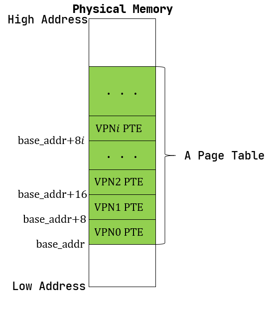
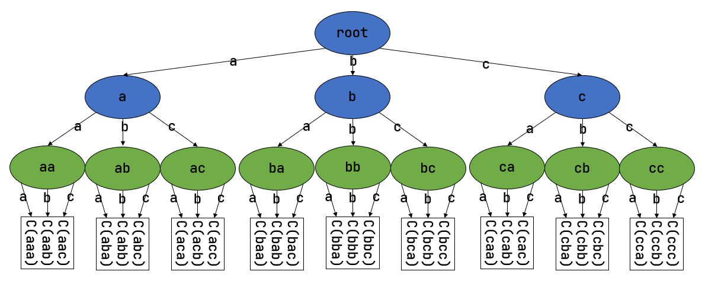
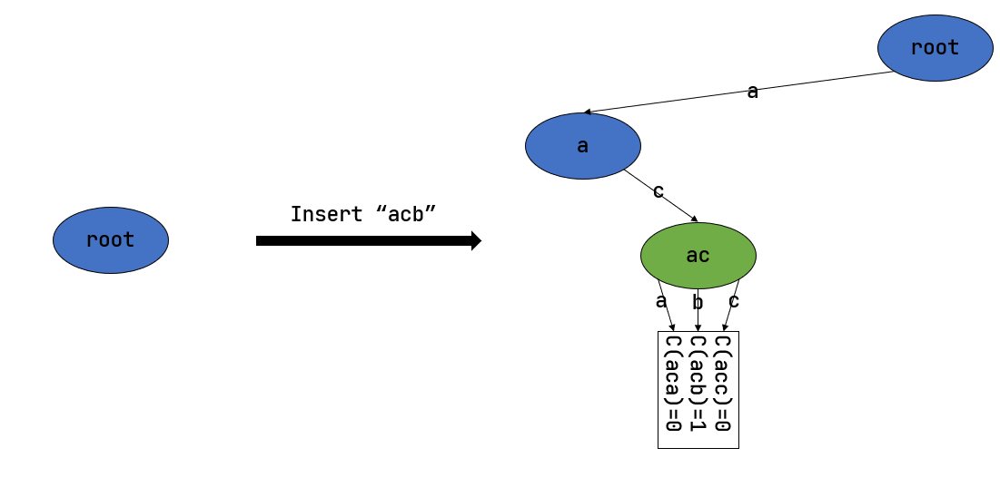
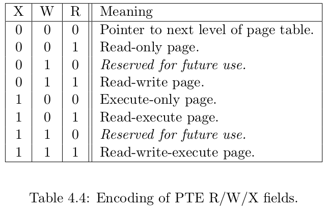
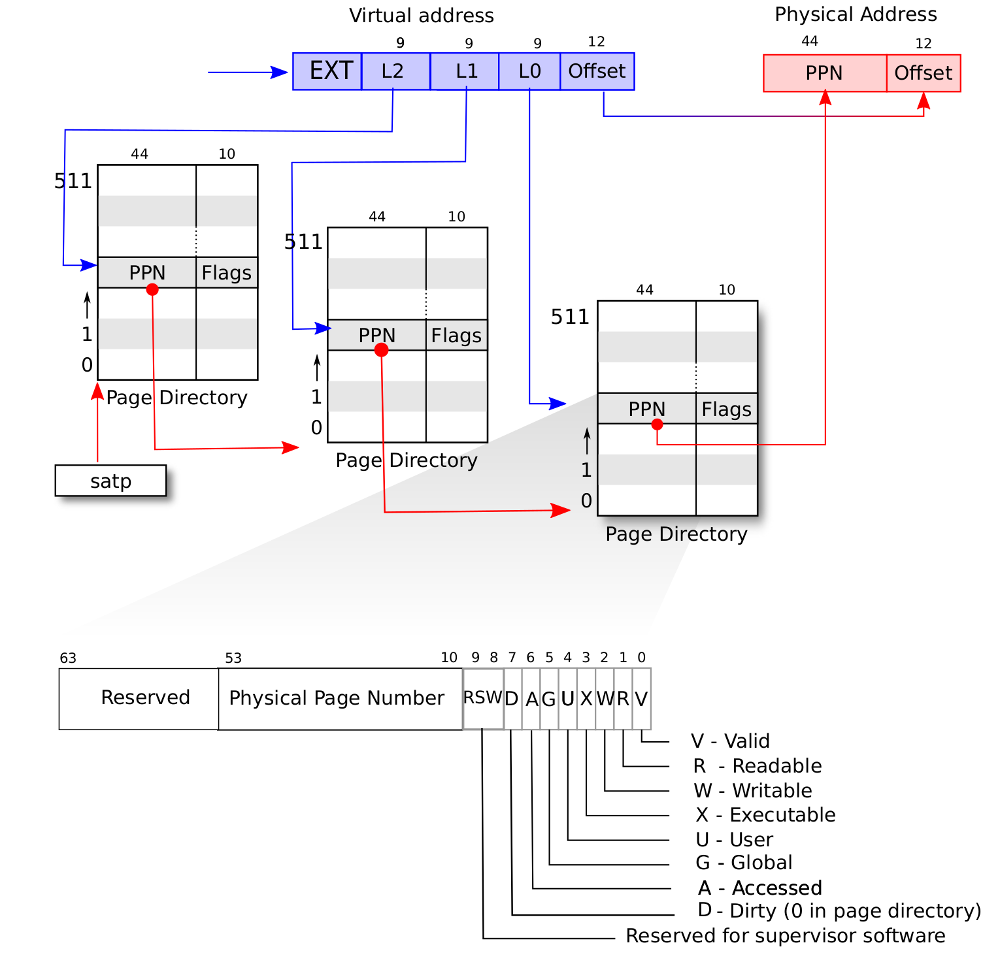

提纲

根据第四章地址空间 SV39多级页表的硬件机制 多级页表的内容说明当前内核使用的SV39多级页表是一颗树

然后解释为什么可以把它看成一颗树

然后开始讲这棵树是怎么建立的 从satp开始 中间要说清楚vpn 9L2 9L1 9L0和  一页512个PTE之间有什么关系 

然后讲怎么查地址 怎么从给定的vpn从页表的这个树上得到ppn

然后介绍TLB


## 虚拟地址和物理地址
### 内存控制相关的CSR寄存器
默认情况下 MMU 未被使能（启用），此时无论 CPU 位于哪个特权级，访存的地址都会作为一个物理地址交给对应的内存控制单元来直接访问物理内存。我们可以通过修改 S 特权级的一个名为 satp 的 CSR 来启用分页模式，在这之后 S 和 U 特权级的访存地址会被视为一个虚拟地址，它需要经过 MMU 的地址转换变为一个物理地址，再通过它来访问物理内存；而 M 特权级的访存地址，我们可设定是内存的物理地址。

M 特权级的访存地址被视为一个物理地址还是一个需要经历和 S/U 特权级相同的地址转换的虚拟地址取决于硬件配置，在这里我们不会进一步探讨。

 

上图是 RISC-V 64 架构下 satp 的字段分布，含义如下：

**·** MODE 控制 CPU 使用哪种页表实现；

**·** ASID 表示地址空间标识符，这里还没有涉及到进程的概念，我们不需要管这个地方；

**·** PPN 存的是根页表所在的物理页号。这样，给定一个虚拟页号，CPU 就可以从三级页表的根页表开始一步步的将其映射到一个物理页号。

当 MODE 设置为 0 的时候，代表所有访存都被视为物理地址；而设置为 8 的时候，SV39 分页机制被启用，所有 S/U 特权级的访存被视为一个 39 位的虚拟地址，它们需要先经过 MMU 的地址转换流程，如果顺利的话，则会变成一个 56 位的物理地址来访问物理内存；否则则会触发异常，这体现了分页机制的内存保护能力。

39 位的虚拟地址可以用来访问理论上最大 $512\text{GB}$ 的地址空间，而 56 位的物理地址在理论上甚至可以访问一块大小比这个地址空间的还高出几个数量级的物理内存。但是实际上无论是虚拟地址还是物理地址，真正有意义、能够通过 MMU 的地址转换或是 CPU 内存控制单元的检查的地址仅占其中的很小一部分，因此它们的理论容量上限在目前都没有实际意义。

### 地址格式与组成

 

 我们采用分页管理，单个页面的大小设置为 $4\text{KB}$ ，每个虚拟页面和物理页帧都对齐到这个页面大小，也就是说虚拟/物理地址区间 $[0,4\text{KB})$ 为第 $0$ 个虚拟页面/物理页帧，而 $[4\text{KB},8\text{KB})$ 为第 $1$ 个，以此类推。 $4\text{KB}$ 需要用 12 位字节地址来表示，因此虚拟地址和物理地址都被分成两部分：它们的低 12 位，即 $[11:0]$ 被称为 **页内偏移** (Page Offset) ，它描述一个地址指向的字节在它所在页面中的相对位置。而虚拟地址的高 27 位，即 $[38:12]$ 为它的虚拟页号 VPN，同理物理地址的高 44 位，即 $[55:12]$ 为它的物理页号 PPN，页号可以用来定位一个虚拟/物理地址属于哪一个虚拟页面/物理页帧。

地址转换是以页为单位进行的，在地址转换的前后地址的页内偏移部分不变。可以认为 MMU 只是从虚拟地址中取出 27 位虚拟页号，在页表中查到其对应的物理页号（如果存在的话），最后将得到的44位的物理页号与虚拟地址的12位页内偏移依序拼接到一起就变成了56位的物理地址。

#### RISC-V 64 架构中虚拟地址为何只有 39 位？

在 64 位架构上虚拟地址长度确实应该和位宽一致为 64 位，但是在启用 SV39 分页模式下，只有低 39 位是真正有意义的。SV39 分页模式规定 64 位虚拟地址的 $[63:39]$ 这 25 位必须和第 38 位相同，否则 MMU 会直接认定它是一个不合法的虚拟地址。通过这个检查之后 MMU 再取出低 39 位尝试将其转化为一个 56 位的物理地址。

也就是说，所有 $2^{64}$ 个虚拟地址中，只有最低的 $256\text{GB}$ （当第 38 位为 0 时）以及最高的 $256\text{GB}$ （当第 38 位为 1 时）是可能通过 MMU 检查的。当我们写软件代码的时候，一个地址的位宽毋庸置疑就是 64 位，我们要清楚可用的只有最高和最低这两部分，尽管它们已经巨大的超乎想象了；而本节中我们专注于介绍 MMU 的机制，强调 MMU 看到的真正用来地址转换的虚拟地址只有 39 位。

## 页表项的数据结构抽象与类型定义

第一小节中我们提到，在页表中以虚拟页号作为索引不仅能够查到物理页号，还能查到一组保护位，它控制了应用对地址空间每个虚拟页面的访问权限。但实际上还有更多的标志位，物理页号和全部的标志位以某种固定的格式保存在一个结构体中，它被称为 **页表项** (PTE, Page Table Entry) ，是利用虚拟页号在页表中查到的结果。


上图为 SV39 分页模式下的页表项，其中 $[53:10]$ 这 $44$ 位是物理页号，最低的 $8$ 位 $[7:0]$ 则是标志位，它们的含义如下（请注意，为方便说明，下文我们用 页表项的对应虚拟页面 来表示索引到一个页表项的虚拟页号对应的虚拟页面）：

**·** V(Valid)：仅当位 V 为 1 时，页表项才是合法的；

**·** R(Read)/W(Write)/X(eXecute)：分别控制索引到这个页表项的对应虚拟页面是否允许读/写/执行；

**·** U(User)：控制索引到这个页表项的对应虚拟页面是否在 CPU 处于 U 特权级的情况下是否被允许访问；

**·** G：暂且不理会；

**·** A(Accessed)：处理器记录自从页表项上的这一位被清零之后，页表项的对应虚拟页面是否被访问过；

**·** D(Dirty)：处理器记录自从页表项上的这一位被清零之后，页表项的对应虚拟页面是否被修改过。

除了 G 外的上述位可以被操作系统设置，只有 A 位和 D 位会被处理器动态地直接设置为 1 ，表示对应的页被访问过或修过（ 注：A 位和 D 位能否被处理器硬件直接修改，取决于处理器的具体实现）。 xv6 源码 kernel/riscv.h 文件中定义了 PTE 相关内容。你可以在实现时直接拷贝 xv6 源码中的宏。

## 多级页表
页表的一种最简单的实现是线性表，也就是按照地址从低到高、输入的虚拟页号从 0 开始递增的顺序依次在内存中（我们之前提到过页表的容量过大无法保存在 CPU 中）放置每个虚拟页号对应的页表项。由于每个页表项的大小是 8 字节，我们只要知道第一个页表项（对应虚拟页号 0 ）被放在的物理地址 base_addr ，就能直接计算出每个输入的虚拟页号对应的页表项所在的位置。如下图所示：

 

 事实上，对于虚拟页号 i ，如果页表（每个应用都有一个页表，这里指其中某一个）的起始地址为 base_adddr ，则这个虚拟页号对应的页表项可以在物理地址 base_addr+8i 处找到。这使得 MMU 的实现和内核的软件控制都变得非常简单。然而遗憾的是，这远远超出了我们的物理内存限制。由于虚拟页号有 $2^{27}$ 种，每个虚拟页号对应一个 8 字节的页表项，则每个页表都需要消耗掉 1GB 内存！应用的数据还需要保存在内存的其他位置，这就使得每个应用要吃掉 1GB 以上的内存。作为对比，我们的 QEMU 模拟设备目前只有 128MB 的内存，因此从空间占用角度来说，这种线性表实现是完全不可行的。

线性表的问题在于：它保存了所有虚拟页号对应的页表项，但是高达 512GB 的地址空间中真正会被应用使用到的只是其中极小的一个子集（本教程中的应用内存使用量约在数十~数百 KB 量级），也就导致有意义并能在页表中查到实际的物理页号的虚拟页号在 $2^{27}$ 中也只是很小的一部分。由此线性表的绝大部分空间其实都是被浪费掉的。

那么如何进行优化呢？核心思想就在于 **按需分配** ，也就是说：有多少合法的虚拟页号，我们就维护一个多大的映射，并为此使用多大的内存用来保存映射。这是因为，每个应用的地址空间最开始都是空的，或者说所有的虚拟页号均不合法，那么这样的页表自然不需要占用任何内存， MMU 在地址转换的时候无需关心页表的内容而是将所有的虚拟页号均判为不合法即可。而在后面，内核已经决定好了一个应用的各逻辑段存放位置之后，它就需要负责从零开始以虚拟页面为单位来让该应用的地址空间的某些部分变得合法，反映在该应用的页表上也就是一对对映射顺次被插入进来，自然页表所占据的内存大小也就逐渐增加。

这种 **按需分配** 思想在计算机科学中得到了广泛应用：为了方便接下来的说明，我们可以举一道数据结构的题目作为例子。设想我们要维护一个字符串的多重集，集合中所有的字符串的字符集均为 $\alpha$=\{a,b,c\} ，长度均为一个给定的常数 n 。该字符串集合一开始为空集。我们要支持两种操作，第一种是将一个字符串插入集合，第二种是查询一个字符串在当前的集合中出现了多少次。

简单起见，假设 n=3 。那么我们可能会建立这样一颗 字典树 (Trie) ：

 

 字典树由若干个节点（图中用椭圆形来表示）组成，从逻辑上而言每个节点代表一个可能的字符串前缀。每个节点的存储内容都只有三个指针，对于蓝色的非叶节点来说，它的三个指针各自指向一个子节点；而对于绿色的叶子节点来说，它的三个指针不再指向任何节点，而是具体保存一种可能的长度为 n 的字符串的计数。这样，对于题目要求的两种操作，我们只需根据输入的字符串中的每个字符在字典树上自上而下对应走出一步，最终就能够找到字典树中维护的它的计数。之后我们可以将其直接返回或者加一。

注意到如果某些字符串自始至终没有被插入，那么一些节点没有存在的必要。反过来说一些节点是由于我们插入了一个以它对应的字符串为前缀的字符串才被分配出来的。如下图所示：

 

 一开始仅存在一个根节点。在我们插入字符串 acb 的过程中，我们只需要分配 a 和 ac 两个节点。注意 ac 是一个叶节点，它的 b 指针不再指向另外一个节点而是保存字符串 acb 的计数。此时我们无法访问到其他未分配的节点，如根节点的 b/c 或是 a 节点的 a/b 均为空指针。如果后续再插入一个字符串，那么 **至多分配两个新节点** ，因为如果走的路径上有节点已经存在，就无需重复分配了。这可以说明，字典树中节点的数目（或者说字典树消耗的内存）是随着插入字符串的数目逐渐线性增加的。

 同学可能很好奇，为何在这里要用相当一部分篇幅来介绍字典树呢？事实上 SV39 分页机制等价于一颗字典树。 27 位的虚拟页号可以看成一个长度 n=3 的字符串，字符集为 $\alpha$=\{0,1,2,...,511\} ，因为每一位字符都由 9 个比特组成。而我们也不再维护所谓字符串的计数，而是要找到字符串（虚拟页号）对应的页表项。因此，每个叶节点都需要保存 512 个 8 字节的页表项，一共正好 4KB ，可以直接放在一个物理页帧内。而对于非叶节点来说，从功能上它只需要保存 512 个指向下级节点的指针即可，不过我们就像叶节点那样也保存 512 个页表项，这样每个节点都可以被放在一个物理页帧内，节点的位置可以用它所在物理页帧的物理页号来代替。当想从一个非叶节点向下走时，只需找到当前字符对应的页表项的物理页号字段，它就指向了下一级节点的位置，这样非叶节点中转的功能也就实现了。每个节点的内部是一个线性表，也就是将这个节点起始物理地址加上字符对应的偏移量就找到了指向下一级节点的页表项（对于非叶节点）或是能够直接用来地址转换的页表项（对于叶节点）。

 这种页表实现被称为 **多级页表** (Multi-Level Page-Table) 。由于 SV39 中虚拟页号被分为三级 **页索引** (Page Index) ，因此这是一种三级页表。在这种三级页表的树结构中，自上而下分为三种不同的节点：一级/二级/三级页表节点。树的根节点被称为一级页表节点；一级页表节点可以通过一级页索引找到二级页表节点；二级页表节点可以通过二级页索引找到三级页表节点；三级页表节点是树的叶节点，通过三级页索引可以找到一个页表项。


非叶节点（页目录表，非末级页表）的表项标志位含义和叶节点（页表，末级页表）相比有一些不同：

**·** 当 V 为 0 的时候，代表当前指针是一个空指针，无法走向下一级节点，即该页表项对应的虚拟地址范围是无效的；

**·** 只有当 V 为1 且 R/W/X 均为 0 时，表示是一个合法的页目录表项，其包含的指针会指向下一级的页表；

**·** 注意: 当 V 为1 且 R/W/X 不全为 0 时，表示是一个合法的页表项，其包含了虚地址对应的物理页号。

在这里我们给出 SV39 中的 R/W/X 组合的含义：



那么 SV39 多级页表相比线性表到底能节省多少内存呢？这里直接给出结论：设某个应用地址空间实际用到的区域总大小为 S 字节，则地址空间对应的多级页表消耗内存为 $\frac{S}{512}$ 左右。下面给出了详细分析，对此不感兴趣的同学可以直接跳过。

### 分析 SV39 多级页表的内存占用

我们知道，多级页表的总内存消耗取决于节点的数目，每个节点需要存放在一个大小为 $4\text{KB}$ 物理页帧中。考虑一个地址空间，除了根节点（即一级页表）占用的一个物理页帧之外，在映射地址空间中的一个实际用到的大小为 $T$ 字节的 $连续$ 区间的时候，最多需要额外分配 $[\frac{T}{1GB}]$ 个二级页表节点和 $[\frac{T}{2MB}]$ 个三级页表节点。这是因为，每个三级页表节点管理地址空间中一块大小为  $4\text{KiB}\times 512=2\text{MiB}$ 的区域，每个二级页表节点管理地址空间中一块大小为 $4\text{KiB}\times 512^2=1\text{GiB}$ 的区域。因此，每连续映射 $1\text{GB}$ 需要在多级页表中分配一个二级页表节点；每连续映射 $2\text{MB}$ 需要在多级页表中分配一个三级页表节点。无论二级/三级页表都需要占用一个 $4\text{KB}$ 的物理页帧，因此映射 $T$ 字节的连续区间需要的额外内存为 $4\text{KB}\times(\lceil\frac{T}{2\text{MB}}\rceil+\lceil\frac{T}{1\text{GB}}\rceil)$ 。相比三级页表，我们可以将二级页表的内存消耗忽略，即省略掉括号中的第二项，最后得到的结果接近于 $\frac{T}{512}$ 。而一般情况下我们对于地址空间的使用方法都是在其中放置少数几个连续的逻辑段，因此当一个地址空间实际使用的区域大小总和为 $S$ 字节的时候，我们可以认为多级页表消耗的内存在 $\frac{S}{512}$ 左右。相比线性表固定消耗 $1\text{GB}$
 的内存，这已经相当可以接受了。

然而，从理论上来说，不妨设某个应用地址空间中的实际用到的总空间大小为 $S$
 字节，则对于这个应用的 SV39 多级页表所需的内存量，有两个更加严格的上限：

**·** 假设目前多级页表中已经分配了一个一级页表节点。接下来，每映射一个 $4\text{KB}$ 的虚拟页面，至多沿着路径额外分配一个二级页表和一个三级页表。之所以是“最多”，是因为路径上经过的二级页表和三级页表可能已经被分配了从而无需重复分配。因此，当总共映射 $S$ 字节时，多级页表的总节点数不超过 $1+2\frac{S}{4\text{KiB}}$ ，故总消耗内存不超过 <br>
$4\text{KiB}\times(1+2\frac{S}{4\text{KiB}})=4\text{KiB}+2S$；

**·** 考虑已经映射了很多虚拟页面，使得根节点（一级页表节点）指向的 $512$ 个二级页表节点都已经被分配的情况（事实上它们不一定都被分配），此时最坏的情况是每次映射都需要分配一个不同的三级页表节点。与上面同理可得：此时消耗内存不超过 <br>$4\text{KiB}\times(1+512+\frac{S}{4\text{KiB}})=4\text{KiB}+2\text{MiB}+S$ 。

虽然这两个上限值都可以通过刻意构造一种地址空间的使用来达到，但是它们看起来很不合理，因为它们均大于 $S$ ，也就是元数据比数据还大。其实，真实环境中一般不会有如此极端的使用方式，一般情况下我们知道多级页表消耗内存为 $\frac{S}{512}$ 左右就行了。

## SV39 地址转换过程
接下来，我们给出 SV39 地址转换的全过程图示（来源于 MIT 6.828 课程）来结束多级页表原理的介绍：



在 SV39 模式中我们采用三级页表，即将 27 位的虚拟页号分为三个等长的部分，第 26-18 位为一级页索引 $\text{VPN}_0$ ，第 17-9 位为二级页索引 $\text{VPN}_1$ ，第 8-0 位为三级页索引 $\text{VPN}_2$ 。

我们也将页表分为一级页表（多级页表的根节点），二级页表，三级页表（多级页表的叶节点）。每个页表都用 9 位索引，因此有 $2^{9}=512$ 个页表项，而每个页表项都是 8 字节，因此每个页表大小都为 $512\times 8=4\text{KiB}$ 。正好是一个物理页的大小。我们可以把一个页表放到一个物理页中，并用一个物理页号来描述它。事实上，一级页表的每个页表项中的物理页号可描述一个二级页表；二级页表的每个页表项中的物理页号可描述一个三级页表；三级页表中的页表项内容则和我们刚才提到的页表项一样，其内容包含物理页号，即描述一个要映射到的物理页。

具体来说，假设我们有虚拟地址 $(\text{VPN}_0, \text{VPN}_1, \text{VPN}_2, \text{offset})$ ：

**·** 我们首先会记录装载「当前所用的一级页表的物理页」的页号到 satp 寄存器中；

**·** 把 $\text{VPN}_0$ 作为偏移在一级页表的物理页中找到二级页表的物理页号；

**·** 把 $\text{VPN}_1$ 作为偏移在二级页表的物理页中找到三级页表的物理页号；

**·** 把 $\text{VPN}_2$ 作为偏移在三级页表的物理页中找到要访问位置的物理页号；

物理页号对应的物理页基址（即物理页号左移12位）加上 $\text{offset}$ 就是虚拟地址对应的物理地址。

这样处理器通过这种多次转换，终于从虚拟页号找到了一级页表项，从而得出了物理页号和虚拟地址所对应的物理地址。刚才我们提到若页表项满足 R,W,X 都为 0，表明这个页表项指向下一级页表。在这里一级和二级页表项的 R,W,X 为 0 应该成立，因为它们指向了下一级页表。


## 物理页帧管理
从前面的介绍可以看出物理页帧的重要性：它既可以用来实际存放应用/内核的数据/代码，也能够用来存储应用/内核的多级页表。当 QEMU 把操作系统内核加载到物理内存中后，物理内存上已经有一部分用于放置内核的代码和数据。我们需要将剩下的空闲内存以单个物理页帧为单位管理起来，当需要存放应用数据或扩展应用的多级页表时分配空闲的物理页帧，并在应用出错或退出的时候回收应用占有的所有物理页帧。

### 可用物理页的分配与回收
首先，我们需要知道物理内存的哪一部分是可用的。在实验一的 linker.ld 中，我们用符号 end 指明了内核数据的终止物理地址，在它之后的物理内存都是可用的。

我们用一个左闭右开的物理页号区间来表示可用的物理内存，则：

**·** 区间的左端点应该是 ekernel 的物理地址以上取整方式转化成的物理页号；

**·** 区间的右端点应该是 MEMORY_END 以下取整方式转化成的物理页号。

这个区间将被传给我们后面实现的物理页帧管理器用于初始化。

你的物理页帧分配器需要实现以下三个函数（你可以用你喜欢的函数名）：

```
void kinit();

void* kalloc(void);

void kfree(void *pa)
```
这部分实现你可以参考 xv6 kernel/kalloc.c 中的实现。其中，kinit 函数负责初始化物理页帧管理器。初始化时你需要把物理页帧管理器管理的物理内存清零，或者像 xv6 一样将物理内存初始化为某个特定值方便 debug；你需要在物理页帧分配器中使用一个你熟悉的数据结构存储所有可用的物理页，在初始化时你需要将所有可用的物理页信息（可以是物理页号或者物理地址）存入这个数据结构。kalloc 函数负责分配物理页帧。它在分配成功时返回指向分配的物理页的指针，在分配失败时返回一个固定值以通知调用它的函数分配失败了。kfree 函数负责回收参数指向的物理页。

## 多级页表管理
### 页表基本数据结构与访问接口
我们知道，SV39 多级页表是以节点为单位进行管理的。每个节点恰好存储在一个物理页帧中，它的位置可以用一个物理页号来表示。每个应用的地址空间都对应一个不同的多级页表，这也就意味这不同页表的起始地址（即页表根节点的地址）是不一样的。因此 PageTable 要保存它根节点的物理页号作为页表唯一的区分标志。

你可以在 xv6 源码的 kernel/vm.c 中找到 xv6 对内核页表的声明 
```
#include "param.h"
#include "types.h"
#include "memlayout.h"
#include "elf.h"
#include "riscv.h"
#include "defs.h"
#include "fs.h"

/*
 * the kernel's page table.
 */
pagetable_t kernel_pagetable;
```
xv6 源码的 kernel/vm.c 中实现了很多关于多级页表管理的函数。好消息是，在实验二中我们只用实现 **walk 、 mappages 和 uvmunmap** 三个函数还有 kvminit 相关函数就可以实现对内核页表的管理。

首先我们需要实现一个辅助函数 walk 这个函数的功能是根据输入的 va 参数在 参数 pagetable 指向的页表中找到 va 对应位置的 pte 并返回指向这个 pte 地址的指针（注意，这里没有说 pte 地址是物理地址还是虚拟地址，这个问题将在下面说明）。这个函数还可以根据 alloc 参数决定在相关 pte 不存在时是创建一个 pte 还是返回 0 。

```
// kernel/vm.c

// Return the address of the PTE in page table pagetable
// that corresponds to virtual address va.  If alloc!=0,
// create any required page-table pages.
pte_t *
walk(pagetable_t pagetable, uint64 va, int alloc);
```


多级页表并不是被创建出来之后就不再变化的，为了 MMU 能够通过地址转换正确找到应用地址空间中的数据实际被内核放在内存中位置，操作系统需要动态维护一个虚拟页号到页表项的映射，支持插入/删除键值对，其方法签名如下：
```
// kernel/vm.c

// Create PTEs for virtual addresses starting at va that refer to
// physical addresses starting at pa. va and size might not
// be page-aligned. Returns 0 on success, -1 if walk() couldn't
// allocate a needed page-table page.
int 
mappages(pagetable_t pagetable, uint64 va, uint64 size, uint64 pa, int perm);

// Remove npages of mappings starting from va. va must be
// page-aligned. The mappings must exist.
// Optionally free the physical memory.
void
uvmunmap(pagetable_t pagetable, uint64 va, uint64 npages, int do_free)
```

在上述操作的过程中，内核需要能访问或修改多级页表节点的内容。即在操作某个多级页表或管理物理页帧的时候，操作系统要能够读写与一个给定的物理页号对应的物理页帧上的数据。这是因为，在多级页表的架构中，每个节点都被保存在一个物理页帧中，一个节点所在物理页帧的物理页号其实就是指向该节点的“指针”。

#### 关于物理地址和虚拟地址：

在尚未启用分页模式之前，内核和应用的代码都可以通过物理地址直接访问内存。而在打开分页模式之后，**运行在 S 特权级的内核与运行在 U 特权级的应用在访存上都会受到影响，它们的访存地址会被视为一个当前地址空间（ satp CSR 给出当前多级页表根节点的物理页号）中的一个虚拟地址**，需要 MMU 查相应的多级页表完成地址转换变为物理地址，即地址空间中虚拟地址指向的数据真正被内核放在的物理内存中的位置，然后才能访问相应的数据。此时，如果想要访问一个特定的物理地址 pa 所指向的内存上的数据，就需要 **构造** 对应的一个虚拟地址 va ，使得当前地址空间的页表存在映射 $\text{va}\rightarrow\text{pa}$ ，且页表项中的保护位允许这种访问方式。于是，在代码中我们只需访问地址 va ，它便会被 MMU 通过地址转换变成 pa ，这样我们就做到了在启用分页模式的情况下也能正常访问内存。

这就需要提前扩充多级页表维护的映射，让每个物理页帧的物理页号 ppn ，均存在一个对应的虚拟页号 vpn ，这需要建立一种映射关系。这里我们采用一种最简单的 **恒等映射** (Identical Mapping) ，即对于物理内存上的每个物理页帧，我们都在多级页表中用一个与其物理页号相等的虚拟页号来映射。

如果你觉得上面这段有点看不懂，我也有一个省流版：

你设置 satp 寄存器前，**所有地址都是物理地址**，你设置了 satp 寄存器后，内核中的**所有地址都会被硬件当成虚拟地址处理**，所有地址都会通过 MMU 翻译（万一你忘记了， MMU 翻译是一个硬件自动进行的过程，你只用知道有这回事就行了，我们软件不用实现这个）。

当然，**所有地址**也包括 sd ld jalr 这种汇编指令访存时使用的地址。
以下面这段汇编为例：
```
void *
kalloc(void)
{
    addi	sp,sp,-32
    sd	ra,24(sp)
    ···
    jalr	220(ra)
    ···
    ld	s1,24(s1)
    ···
}
```
你设置了 satp 后，计算机执行命令时会把这里的 24(sp) 、 220(ra) 、 24(s1)都当成虚拟地址处理。所以，为了实现简便，我们就要在实现内核页表时使用**恒等映射** (Identical Mapping) 。

### 多级页表初始化

在实现了上面页表管理相关函数后，我们就可以实现页表初始化函数了。由于我们这里使用的是恒等映射，多级页表初始化函数就比较简单，直接 map 我们的物理内存对应区域就可以了。

```
//kernel/vm.c

// Make a direct-map page table for the kernel.
pagetable_t
kvmmake(void);
```
## 快表（TLB）
我们知道，物理内存的访问速度要比 CPU 的运行速度慢很多。如果我们按照页表机制循规蹈矩的一步步走，将一个虚拟地址转化为物理地址需要访问 3 次物理内存，得到物理地址后还需要再访问一次物理内存，才能完成访存。这无疑很大程度上降低了系统执行效率。

实践表明绝大部分应用程序的虚拟地址访问过程具有时间局部性和空间局部性的特点。因此，在 CPU 内部，我们使用MMU中的 **快表（TLB, Translation Lookaside Buffer）** 来作为虚拟页号到物理页号的映射的页表缓存。这部分知识在计算机组成原理课程中有所体现，当我们要进行一个地址转换时，会有很大可能对应的地址映射在近期已被完成过，所以我们可以先到 TLB 缓存里面去查一下，如果有的话我们就可以直接完成映射，而不用访问那么多次内存了。

上面主要是对单个应用的多级页表进行了介绍。在一个多任务系统中，可能同时存在多个任务处于运行/就绪状态，它们各自的多级页表在内存中共存，那么 MMU 应该如何知道当前做地址转换的时候要查哪一个页表呢？回到 satp CSR 的布局 ，其中的 PPN 字段指的就是多级页表根节点所在的物理页号。因此，每个应用的地址空间就可以用包含了它多级页表根节点所在物理页号的 satp CSR 代表。在我们切换任务的时候， satp 也必须被同时切换。

但如果修改了 satp 寄存器，说明内核切换到了一个与先前映射方式完全不同的页表。此时快表里面存储的映射已经失效了，这种情况下内核要在修改 satp 的指令后面马上使用 sfence.vma 指令刷新清空整个 TLB。

同样，我们手动修改一个页表项之后，也修改了映射，但 TLB 并不会自动刷新清空，我们也需要使用 sfence.vma 指令刷新整个 TLB。注：可以在 sfence.vma 指令后面加上一个虚拟地址，这样 sfence.vma 只会刷新TLB中关于这个虚拟地址的单个映射项。

当然，快表的管理也是一个硬件自动过程。你在编写内核时只用记住在修改了 satp 寄存器或手动修改一个页表项之后调用sfence.vma 指令刷新对应 TLB 就行了。