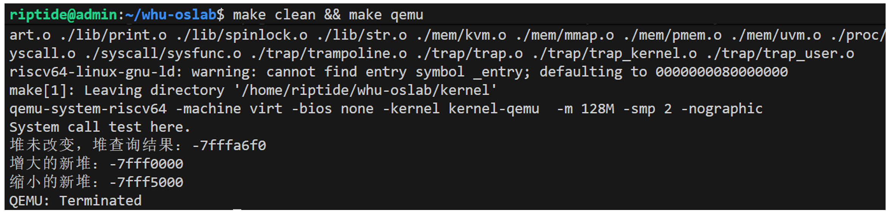

## 实验任务和⽬标
1. 通过分析 xv6 的系统调⽤机制，深⼊理解⽤户态与内核态的交互⽅式。
2. 参考 xv6 代码，实现完整的系统调⽤框架。
3. 在单进程的情况下，实现⼀些功能较⼩的系统调⽤，如⽆功能系统调⽤ SYS_test ，修改⽤户进程堆空间的 SYS_brk 。

## 运行测试

本实验中你需要运行以下测试。你使用的测试代码不用完全和下面的代码一样，你只用确保测试内容包括下面这些就可以了。考虑到你还要写实验报告，你的测试代码最好有相应中间过程输出，用来证明你完成了这个实验。

实验五中，你只需要运行以下 initcode 代码然后观察 SYS_brk 系统调用的中间过程输出是否正常就可以了。

initcode 代码如下：

```
#include "sys.h" 
int main()
{ 
    syscall(SYS_test); 

    long long heap_top = syscall(SYS_brk, 0); 

    heap_top = syscall(SYS_brk, heap_top + 4096 * 10); 

    heap_top = syscall(SYS_brk, heap_top - 4096 * 5); 

    while(1); 

    return 0; 
}
```

中间过程输出示例如下：

```
uint64 sys_brk()
{
    uint64 new_heap_top;
    uint64 old_heap_top;
    uint64 res;
    pgtbl_t pgtbl = myproc()->pgtbl;

    arg_uint64(0, &new_heap_top);
    old_heap_top = myproc()->heap_top;

    if(new_heap_top == 0){
        printf("堆未改变，堆查询结果：%x\n", old_heap_top);
        return old_heap_top;
    }
    else if(new_heap_top > old_heap_top){
        // 需要增大堆空间
        res = uvm_heap_grow(pgtbl, old_heap_top, new_heap_top - old_heap_top);
        printf("增大的新堆：%x\n", res);
        return res;
    }
    else{
        // 需要缩小堆空间
        res = uvm_heap_ungrow(pgtbl, old_heap_top, old_heap_top - new_heap_top);
        printf("缩小的新堆：%x\n", res);
        return res;
    }
}
```

你可以参考这个样例输出：


