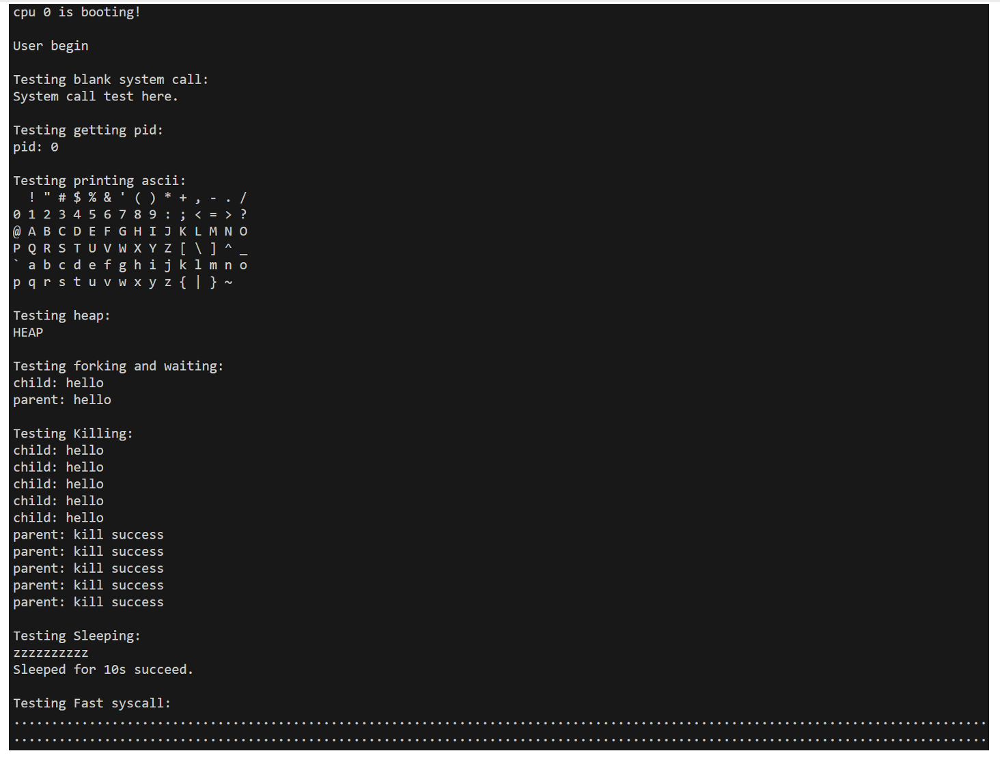
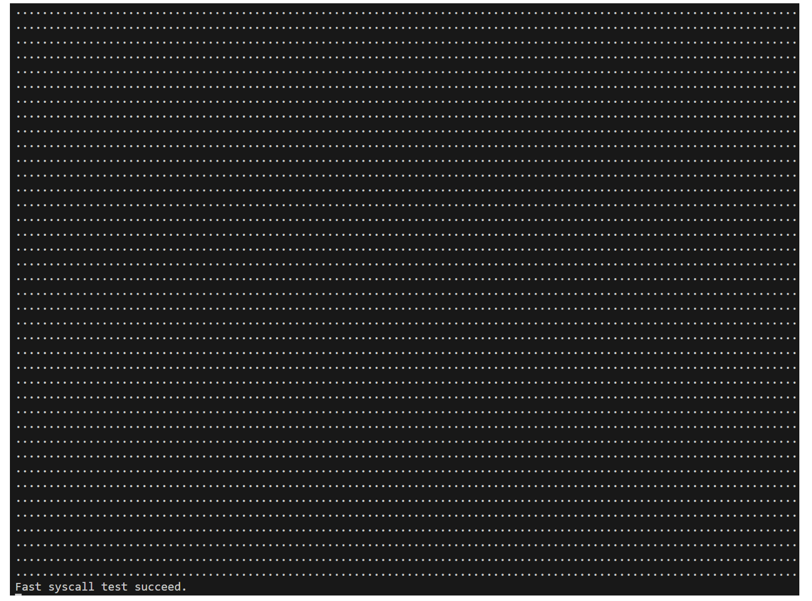

## 实验任务和⽬标
1. 进⼀步分析xv6的进程管理机制，理解操作系统如何创建和管理进程，实现完整的进程声明周期管理和简单的调度算法，从⽽实现多进程进⾏。
2. 利⽤多进程的功能，进⼀步扩充实现常⽤系统调⽤功能，例如SYS_fork，SYS_exit等。

## 运行测试

本实验中你需要运行以下测试。你使用的测试代码不用完全和下面的代码一样，你只用确保测试内容包括下面这些就可以了。考虑到你还要写实验报告，你的测试代码最好有相应中间过程输出，用来证明你完成了这个实验。

本实验为进程的测试以及系统调⽤提供了⼀系列测试，测试代码放在⽤户态代码 initcode 中。你只用运行这个测试代码然后观察结果是否正确就可以了。具体代码如下:

```
#include "sys.h"

// 与内核保持一致
#define VA_MAX       (1ul << 38)
#define PGSIZE       4096
#define MMAP_END     (VA_MAX - 34 * PGSIZE)
#define MMAP_BEGIN   (MMAP_END - 8096 * PGSIZE) 

char *str1, *str2;

int main()
{
    // 用户进程的开始
    syscall(SYS_print, "\nUser begin\n");

    // 空白系统调用测试
    syscall(SYS_print, "\nTesting blank system call:\n");
    syscall(SYS_test);

    // 进程号调用测试（基本）
    syscall(SYS_print, "\nTesting getting pid:\n");
    int id = syscall(SYS_getpid);
    char* str = "pid: _\n";
    str[5] = '0' + id;
    syscall(SYS_print, str);

    // 输出系统调用测试（输出所有非控制ascii字符，16个1行）
    syscall(SYS_print, "\nTesting printing ascii:\n");
    for(int i=0x20; i<0x7F; i++){
        char* str = "_ ";
        str[0] = i;
        syscall(SYS_print, str);
        if((i - 0x20) % 16 == 15){
            syscall(SYS_print, "\n");
        }
    }
    syscall(SYS_print, "\n");

    // 测试HEAP区域
    syscall(SYS_print, "\nTesting heap:\n");
    long long top = syscall(SYS_brk, 0);
    str2 = (char*)top;
    syscall(SYS_brk, top + PGSIZE);
    str2[0] = 'H';
    str2[1] = 'E';
    str2[2] = 'A';
    str2[3] = 'P';
    str2[4] = '\n';
    str2[5] = '\0';
    syscall(SYS_print, str2);

    // 测试进程的fork, wait, exit
    syscall(SYS_print, "\nTesting forking and waiting:\n");
    int pid = syscall(SYS_fork);
    if(pid == 0) { // 子进程
        for(int i = 0; i < 100000000; i++);
        syscall(SYS_print, "child: hello\n");
        syscall(SYS_exit, 1);
        syscall(SYS_print, "child: never back\n");
    } else {       // 父进程
        int exit_state;
        int sonid = syscall(SYS_wait, &exit_state);
        if(sonid == pid && exit_state == 1)
            syscall(SYS_print, "parent: hello\n");
        else
            syscall(SYS_print, "parent: error\n");
    }

    // 测试进程的杀死
    syscall(SYS_print, "\nTesting Killing:\n");
    int sons = 5;
    int pids[sons];
    for(int i=0; i<sons; i++){
        int pid = syscall(SYS_fork);
        if(pid == 0){
            syscall(SYS_print, "child: hello\n");
            while(1) {}
        }
        else{
            pids[i] = pid;
        }
    }
    for(int i = 0; i < 100000000; i++);
    for(int i=0; i<sons; i++){
        int res = syscall(SYS_kill, pids[i]);
        if(res == 0){
            syscall(SYS_print, "parent: kill success\n");
        }
        else{
            syscall(SYS_print, "parent: kill failed\n");
        }
    }

    // 测试进程的sleep
    syscall(SYS_print, "\nTesting Sleeping:\n");
    for(int i=0; i<10; i++){
        syscall(SYS_sleep, 10);
        syscall(SYS_print, "z");
    }
    syscall(SYS_print, "\nSleeped for 10s succeed.\n");

    // 快速系统调用压力测试
    syscall(SYS_print, "\nTesting Fast syscall:\n");
    int times = 100000;
    for(int i=0; i<times; i++){
        // syscall(SYS_test);
        syscall(SYS_sleep, 0);
        syscall(SYS_getpid);
        
        //char* c = (i % 10000 == 0) ? "#" : "";
        //syscall(SYS_print, c);
        syscall(SYS_print, ".");
    }
    syscall(SYS_print, "\nFast syscall test succeed.\n");

    while(1);
    
    return 0;
}
```
此处，所有的进程功能调试都是通过系统调⽤间接使⽤的。本测试代码包含如下测试：

**·** 空⽩系统功能调⽤测试:测试空⽩系统功能调⽤功能（即除了系统调⽤框架其他均⽆）是否正常

**·** 进程号调⽤测试:测试系统调⽤号是否能够获取

**·** 输出系统调⽤测试:通过输出所有⾮控制ascii字符，16个1⾏从⽽测试功能是否正常

**·** 堆区域测试:测试堆增⼤/减⼩的系统调⽤是否正常

**·** fork, wait, exit测试:测试这些功能是否正常

**·** 杀死测试:通过杀死5个死循环⼦进程从⽽测试功能是否正常

**·** sleep测试:通过测试系统睡眠从⽽判断功能是否正常

**·** 压⼒测试:通过快速重复进⾏系统调⽤，从⽽测试系统抗压能⼒

你可以参考这个样例输出：




