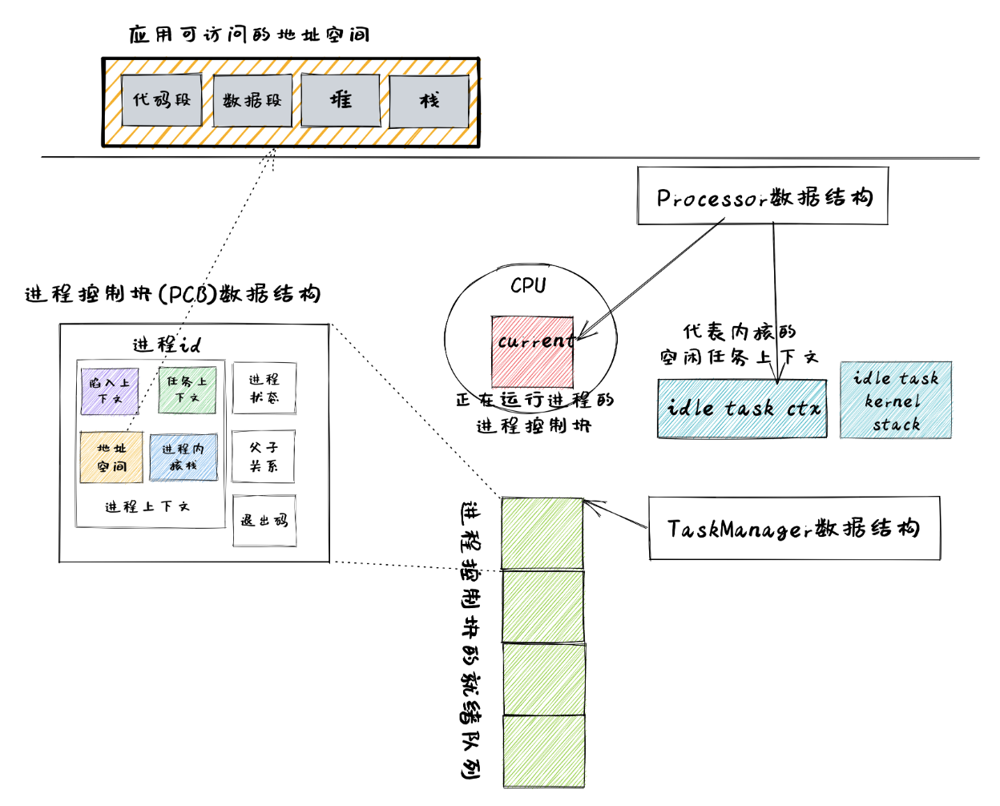
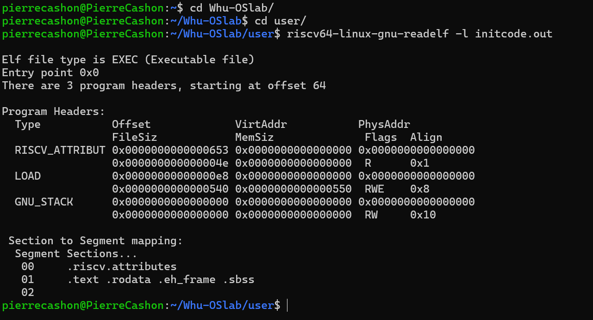

## 进程概念
在实验六中，出于方便应用开发和使得应用功能更加强大的目标，我们将引入进程的概念。在实验六之前，我们有 **任务** 的概念，即 **正在执行的程序** ，主角是程序。而相比于 **任务** ， **进程** (Process) 的含义是 **在操作系统管理下的程序的一次执行过程**。这里的“程序的”成了形容词，而执行过程成为了主角，这充分体现了动态变化的执行特点。尽管这说起来很容易，但事实上进程是一个内涵相当丰富且深刻、难以从单个角度解释清楚的抽象概念。我们可以先试着从动态和静态的角度来进行初步的思考。我们知道，当一个应用的源程序被编译器成功构建之后，它会从源代码变为某种格式的可执行文件，如果将其展开，可以在它的内存布局中看到若干个功能迥异的逻辑段。但如果仅是这样，它也就只是某种格式特殊的、被 **静态** 归档到存储器上的一个文件而已。

然而，可执行文件与其他类型文件的根本性不同在于它可以被内核加载并执行。这一执行过程自然是不能凭空进行的，而是需要占据某些真实的硬件资源。例如，可执行文件一定需要被加载到物理内存的某些区域中才能执行，另外还可能需要预留一些可执行文件内存布局中未规划的区域（比如堆和栈），这就会消耗掉部分内存空间；在执行的时候需要占据一个 CPU 的全部硬件资源，我们之前介绍过的有通用寄存器（其中程序计数器 pc 和栈指针 sp 两个意义尤其重大）、CSR 、各级 cache 、TLB 等。

打一个比方，可执行文件本身可以看成一张编译器解析源代码之后总结出的一张记载如何利用各种硬件资源进行一轮生产流程的 **蓝图** 。而内核的一大功能便是作为一个硬件资源管理器，它可以随时启动一轮生产流程（即执行任意一个应用），这需要选中一张蓝图（此时确定执行哪个可执行文件），接下来就需要内核按照蓝图上所记载的对资源的需求来对应的将各类资源分配给它，让这轮生产流程得以顺利进行。当按照蓝图上的记载生产流程完成（应用退出）之后，内核还需要将对应的硬件资源回收以便后续的重复利用。

因此，进程就是操作系统选取某个可执行文件并对其进行一次动态执行的过程。相比可执行文件，它的动态性主要体现在：

1. 它是一个过程，从时间上来看有开始也有结束；

2. 在该过程中对于可执行文件中给出的需求要相应对 **硬件/虚拟资源** 进行 **动态绑定和解绑** 。

这里需要指出的是，两个进程可以选择同一个可执行文件执行，然而它们却是截然不同的进程：它们的启动时间、占据的硬件资源、输入数据均有可能是不同的，这些条件均会导致它们是不一样的执行过程。在某些情况下，我们可以看到它们的输出是不同的——这是其中一种可能的直观表象。

当然，本实验中不涉及对可执行文件的执行，我们只需要从 initcode 加载我们的应用程序。

在内核中，需要有一个进程管理器，在其中记录每个进程对资源的占用情况，这是内核作为一个硬件资源管理器所必须要做到的。进程管理器通常需要管理多个进程，因为如果同一时间只有一个进程的话，就可以简单的将所有的硬件资源都交给该进程，同时内核也会退化成一个函数库。

接下来主要站在应用开发者和用户的角度来介绍如何理解进程概念并基于它编写应用程序。

## 进程模型与重要系统调用
目前，我们只介绍本实验实现的内核中采用的一种非常简单的进程模型。这个进程模型有五个运行状态：就绪态、运行态和未使用态、睡眠态和僵尸态；有基于独立页表的地址空间；可被操作系统调度来分时占用 CPU 执行；可以动态创建和退出；可通过系统调用获得操作系统的服务。

前面我们并没有给出进程需要使用哪些类型的资源，这其实取决于内核提供给应用的系统调用接口以及内核的具体实现。我们实现的进程模型建立在地址空间抽象之上：每个进程都需要一个地址空间，它涵盖了它选择的可执行文件的内存布局，还包含一些其他的逻辑段。且进程模型需要操作系统支持一些重要的系统调用：创建进程、执行新程序、等待进程结束等，来达到应用程序执行的动态灵活性。接下来会介绍这些系统调用的基本功能和设计思路。

这里只是先介绍一下这些系统调用，按照代码执行顺序你可以最后再实现它们。

### fork 系统调用
系统中同一时间存在的每个进程都被一个不同的 **进程标识符** (PID, Process Identifier) 所标识。在内核初始化完毕之后会创建一个进程——即 **用户初始进程** (Initial Process) ，它是目前在内核中以硬编码方式创建的唯一一个进程。其他所有的进程都是通过一个名为 fork 的系统调用来创建的。

```
//kernel/proc.c

/// 功能：当前进程 fork 出来一个子进程。
/// 返回值：对于子进程返回 0，对于当前进程则返回子进程的 PID 。
int fork(void);
```

进程 A 调用 fork 系统调用之后，内核会创建一个新进程 B，这个进程 B 和调用 fork 的进程A在它们分别返回用户态那一瞬间几乎处于相同的状态：这意味着它们包含的用户态的代码段、堆栈段及其他数据段的内容完全相同，但是它们是被放在两个独立的地址空间中的。因此新进程的地址空间需要从原有进程的地址空间完整拷贝一份。两个进程通用寄存器也几乎完全相同。例如， pc 相同意味着两个进程会从同一位置的一条相同指令（我们知道其上一条指令一定是用于系统调用的 ecall 指令）开始向下执行， sp 相同则意味着两个进程的用户栈在各自的地址空间中的位置相同。其余的寄存器相同则确保了二者回到了相同的控制流状态。

但是唯有用来保存 fork 系统调用返回值的 a0 寄存器（这是 RISC-V 64 的函数调用规范规定的函数返回值所用的寄存器）的值是不同的。这区分了两个进程：原进程的返回值为它新创建进程的 PID ，而新创建进程的返回值为 0 。由于新的进程是原进程主动调用 fork 衍生出来的，我们称新进程为原进程的 **子进程** (Child Process) ，相对的原进程则被称为新进程的 **父进程** (Parent Process) 。这样二者就建立了一种父子关系。注意到每个进程可能有多个子进程，但最多只能有一个父进程，于是所有进程可以被组织成一颗树，其根节点正是代表用户初始程序——initproc，也即第一个用户态的初始进程。

相比创建一个进程， fork 的另一个重要功能是建立一对新的父子关系。在我们的进程模型中，父进程和子进程之间的联系更为紧密，它们更容易进行合作或通信，而且一些重要的机制也需要在它们之间才能展开。

### exit 系统调用
进程在运行完毕后，会调用 exit 系统调用退出。在进程 exit 时，我们需要将进程所有的子进程移交给父进程，然后将自身状态标记为 ZOMBIE 。其余资源，如地址空间等将在 wait 系统调用中由父进程回收。

```
//kernel/proc.c

// Exit the current process.  Does not return.
// An exited process remains in the zombie state
// until its parent calls wait().
void exit(int status);
```

### wait 系统调用
当一个进程通过 exit 系统调用退出之后，它所占用的资源并不能够立即全部回收。比如该进程的内核栈目前就正用来进行系统调用处理，如果将放置它的物理页帧回收的话，可能会导致系统调用不能正常处理。对于这种问题，一种典型的做法是当进程退出的时候内核立即回收一部分资源并将该进程标记为 僵尸进程 (Zombie Process) 。之后，由该进程的父进程通过一个名为 wait 的系统调用来收集该进程的返回状态并回收掉它所占据的全部资源，这样这个进程才被彻底销毁。系统调用 wait 的原型如下：

```
//kernel/proc.c

// Wait for a child process to exit and return its pid.
// Return -1 if this process has no children.
// 将退出的子进程的 state 放入参数传入的用户地址 addr
int wait(uint64 addr);
```

一般情况下一个进程要负责通过 wait 系统调用来等待它 fork 出来的子进程结束并回收掉它们占据的资源，这也是父子进程间的一种同步手段。但这并不是必须的。如果一个进程先于它的子进程结束，在它退出的时候，它的所有子进程将成为进程树的根节点——用户初始进程的子进程，同时这些子进程的父进程也会转成用户初始进程。这之后，这些子进程的资源就由用户初始进程负责回收了。不过，在实验六中我们不会遇到一个进程先于它的子进程结束这种情况。

## 进程管理的核心数据结构

为了更好实现进程管理，同时也使得操作系统整体架构更加灵活，能够满足后续的一些需求，我们需要设计一些数据结构包含的内容及接口。本节将按照如下顺序来进行介绍：

**·** 进程标识符 pid 以及内核栈 kstack ：进程控制块的重要组成部分。

**·** 任务控制块 proc ：表示进程的核心数据结构。

**·** 任务管理器 proc 数组 ：管理进程集合的核心数据结构。

**·** 处理器管理结构 cpu ：用于进程调度，维护进程的处理器状态。

**在实验六中，你需要首先实现进程管理功能**。

### 进程标识符和内核栈
#### 进程标识符

同一时间存在的所有进程都有一个唯一的进程标识符，它们是互不相同的整数，这样才能表示表示进程的唯一性。

我们使用不回收的 pid 分配方式：

```
//kernel/proc.c

int
allocpid()
{
  int pid;
  
  acquire(&pid_lock);
  pid = nextpid;
  nextpid = nextpid + 1;
  release(&pid_lock);

  return pid;
}
```

#### 内核栈

在前面的章节中我们介绍过 内核地址空间布局 ，当时我们将每个应用的内核栈按照应用编号从小到大的顺序将它们作为逻辑段从高地址到低地址放在内核地址空间中，且两两之间保留一个守护页面使得我们能够尽可能早的发现内核栈溢出问题。

xv6 在启动时为 proc 数组里的所有 proc 结构初始化了内核栈，我们在分配 proc 结构时直接使用就可以了：

```
//kernel/proc.c

// Allocate a page for each process's kernel stack.
// Map it high in memory, followed by an invalid
// guard page.
void
proc_mapstacks(pagetable_t kpgtbl)
{
  struct proc *p;
  
  for(p = proc; p < &proc[NPROC]; p++) {
    char *pa = kalloc();
    if(pa == 0)
      panic("kalloc");
    uint64 va = KSTACK((int) (p - proc));
    kvmmap(kpgtbl, va, (uint64)pa, PGSIZE, PTE_R | PTE_W);
  }
}

// initialize the proc table.
void
procinit(void)
{
  struct proc *p;
  
  initlock(&pid_lock, "nextpid");
  initlock(&wait_lock, "wait_lock");
  for(p = proc; p < &proc[NPROC]; p++) {
      initlock(&p->lock, "proc");
      p->state = UNUSED;
      p->kstack = KSTACK((int) (p - proc));
  }
}
```
```
//kernel/vm.c

// Make a direct-map page table for the kernel.
pagetable_t
kvmmake(void)
{
  pagetable_t kpgtbl;

  kpgtbl = (pagetable_t) kalloc();
  memset(kpgtbl, 0, PGSIZE);

  ······

  // allocate and map a kernel stack for each process.
  proc_mapstacks(kpgtbl);
  
  return kpgtbl;
}
```

#### 进程控制块

在内核中，每个进程的执行状态、资源控制等元数据均保存在一个被称为 **进程控制块** (PCB, Process Control Block) 的结构中，它是内核对进程进行管理的单位，故而是一种极其关键的内核数据结构。在内核看来，它就等价于一个进程。



注：图中的 Processor 数据结构在 xv6 中对应 cpu 数据结构，TaskManager 数据结构在 xv6 中对应 proc 数组。

我们仅需对任务控制块 proc 进行若干改动并让它直接承担进程控制块的功能：
```
struct proc {
    struct spinlock lock;         // 自旋锁

    // 使用前需要持有p->lock才能访问
    int pid;                 // 标识符
    enum procstate state;    // 进程状态
    void *chan;              // If non-zero, sleeping on chan
    int xstate;              // 进程退出时的状态
    bool killed;              // 是否已被杀死（功能有待扩展）
    
    // 使用前需要持有wait_lock才能访问
    struct proc *parent;     // 父进程

    // 每个进程独立的数据，访问时无需上锁
    pagetable_t pagetable;   // 用户态页表
    uint64 sz;               // Size of process memory (bytes)
    uint64 ustack_pages;     // 用户栈占用的页面数量
    struct trapframe *trapframe; // 用户态内核态切换时的运行环境暂存空间

    uint64 kstack;           // 内核栈的虚拟地址
    struct context context;  // 内核态进程上下文
};
```

#### 任务管理器

任务管理器自身仅负责管理所有 proc 结构的分配和回收。xv6 提供了下面这两个函数：
```
//kernel/proc.c

// Look in the process table for an UNUSED proc.
// If found, initialize state required to run in the kernel,
// and return with p->lock held.
// If there are no free procs, or a memory allocation fails, return 0.
static struct proc*
allocproc(void);

// free a proc structure and the data hanging from it,
// including user pages.
// p->lock must be held.
static void
freeproc(struct proc *p);
```

#### 处理器管理结构

处理器管理结构维护着 CPU 当前在执行哪个任务：
```
// Per-CPU state.
struct cpu {
  struct proc *proc;    // The process running on this cpu, or null.
  struct context context;     // swtch() here to enter scheduler().
  int noff;                   // Depth of push_off() nesting.
  int intena;         // Were interrupts enabled before push_off()?
};
```

在 cpu 中存放所有在运行过程中可能变化的内容，目前包括：

**·** proc 表示在当前处理器上正在执行的任务；

**·** context 表示当前处理器上的 idle 控制流的任务上下文。

##### 正在执行的任务

在抢占式调度模型中，在一个处理器上执行的任务常常被换入或换出，因此我们需要维护在一个处理器上正在执行的任务，可以查看它的信息或是对它进行替换。

##### 任务调度的 idle 控制流

cpu 有一个不同的 idle 控制流，它运行在这个 CPU 核的启动栈上，功能是尝试从任务管理器中选出一个任务来在当前 CPU 核上执行。在内核初始化完毕之后，会通过调用 scheduler 函数来进入 idle 控制流：

```
//kernel/proc.c

// Per-CPU process scheduler.
// Each CPU calls scheduler() after setting itself up.
// Scheduler never returns.  It loops, doing:
//  - choose a process to run.
//  - swtch to start running that process.
//  - eventually that process transfers control
//    via swtch back to the scheduler.
void
scheduler(void)
{
  struct proc *p;
  struct cpu *c = mycpu();
  
  c->proc = 0;
  for(;;){
    // Avoid deadlock by ensuring that devices can interrupt.
    intr_on();

    for(p = proc; p < &proc[NPROC]; p++) {
      acquire(&p->lock);
      if(p->state == RUNNABLE) {
        // Switch to chosen process.  It is the process's job
        // to release its lock and then reacquire it
        // before jumping back to us.
        p->state = RUNNING;
        c->proc = p;
        swtch(&c->context, &p->context);

        // Process is done running for now.
        // It should have changed its p->state before coming back.
        c->proc = 0;
      }
      release(&p->lock);
    }
  }
}
```

可以看到，调度功能的主体是 scheduler() 。它循环查找任务管理器直到顺利从任务管理器中取出一个任务，随后便准备通过任务切换的方式来执行：

**·** 我们需要先获取从任务管理器中取出对应的任务控制块，并获取任务块内部的 p->context 作为 swtch 的第二个参数，然后修改任务的状态为 RUNNING 。

**·** 接着我们修改当前 cpu 正在执行的任务为我们取出的任务。

**·** 最后我们调用 swtch 来从当前的 idle 控制流切换到接下来要执行的任务。

上面介绍了从 idle 控制流通过任务调度切换到某个任务开始执行的过程。而反过来，当一个应用用尽了内核本轮分配给它的时间片或者它主动调用 yield 系统调用交出 CPU 使用权之后，内核会调用 sched 函数来切换到 idle 控制流并开启新一轮的任务调度。

```
///kernel/proc.c

// Switch to scheduler.  Must hold only p->lock
// and have changed proc->state. Saves and restores
// intena because intena is a property of this
// kernel thread, not this CPU. It should
// be proc->intena and proc->noff, but that would
// break in the few places where a lock is held but
// there's no process.
void
sched(void)
{
  int intena;
  struct proc *p = myproc();

  if(!holding(&p->lock))
    panic("sched p->lock");
  if(mycpu()->noff != 1)
    panic("sched locks");
  if(p->state == RUNNING)
    panic("sched running");
  if(intr_get())
    panic("sched interruptible");

  intena = mycpu()->intena;
  swtch(&p->context, &mycpu()->context);
  mycpu()->intena = intena;
}
```

你可能会好奇这个调度器线程是从哪来的。事实上，我们的启动线程在完成了操作系统的初始化中会主动调用 scheduler 函数，然后就一直在 scheduler 函数里充当调度器。在我们切换到第一个进程时，我们会把启动线程的 context 存到 cpu 结构的context 中。

```
//kernel/main.c

// start() jumps here in supervisor mode on all CPUs.
void
main()
{
  if(cpuid() == 0){
    consoleinit();
    printfinit();
    printf("\n");
    printf("xv6 kernel is booting\n");
    ······
    userinit();      // first user process
    __sync_synchronize();
    started = 1;
  } else {
    while(started == 0)
      ;
    __sync_synchronize();
    printf("hart %d starting\n", cpuid());
    kvminithart();    // turn on paging
    trapinithart();   // install kernel trap vector
    plicinithart();   // ask PLIC for device interrupts
  }

  scheduler();        
}
```

**在你的系统可以完成 idle 控制流的切换并能够开始执行我们的 initcode 应用程序后，你就可以开始实现上面的系统调用了**。

## 进程管理机制的设计实现

### 进程调度机制

xv6 通过调用 kernel/proc.c 文件提供的 yield 函数可以暂停当前任务并切换到下一个任务，当应用调用 yield 主动交出使用权、本轮时间片用尽或者由于某些原因内核中的处理无法继续的时候，就会在内核中调用此函数触发调度机制并进行任务切换。下面给出了两种典型的使用情况：

```
//kernel/trap.c

// interrupts and exceptions from kernel code go here via kernelvec,
// on whatever the current kernel stack is.
void 
kerneltrap()
{
  int which_dev = 0;
  ······
  // give up the CPU if this is a timer interrupt.
  if(which_dev == 2 && myproc() != 0 && myproc()->state == RUNNING)
    yield();
instruction.
  w_sepc(sepc);
  w_sstatus(sstatus);
}

//
// handle an interrupt, exception, or system call from user space.
// called from trampoline.S
//
void
usertrap(void)
{
  int which_dev = 0;
  ······
  // give up the CPU if this is a timer interrupt.
  if(which_dev == 2)
    yield();

  usertrapret();
}
```

### 进程的生成机制

在内核中手动生成的进程只有初始进程，余下所有的进程都是它直接或间接 fork 出来的。面我们来介绍 fork 的实现。

#### fork 系统调用的实现
在实现 fork 的时候，最为关键且困难的是为子进程创建一个和父进程几乎完全相同的应用地址空间。 xv6 的实现如下：

```
//kernel/vm.c

// Given a parent process's page table, copy
// its memory into a child's page table.
// Copies both the page table and the
// physical memory.
// returns 0 on success, -1 on failure.
// frees any allocated pages on failure.
int
uvmcopy(pagetable_t old, pagetable_t new, uint64 sz)
{
  pte_t *pte;
  uint64 pa, i;
  uint flags;
  char *mem;

  for(i = 0; i < sz; i += PGSIZE){
    if((pte = walk(old, i, 0)) == 0)
      panic("uvmcopy: pte should exist");
    if((*pte & PTE_V) == 0)
      panic("uvmcopy: page not present");
    pa = PTE2PA(*pte);
    flags = PTE_FLAGS(*pte);
    if((mem = kalloc()) == 0)
      goto err;
    memmove(mem, (char*)pa, PGSIZE);
    if(mappages(new, i, PGSIZE, (uint64)mem, flags) != 0){
      kfree(mem);
      goto err;
    }
  }
  return 0;

 err:
  uvmunmap(new, 0, i / PGSIZE, 1);
  return -1;
}
```

这里我们遍历原地址空间中除了 TRAMPOLINE 和 TRAPFRAME 之外的所有页，逐个复制页内容并映射到新地址空间。

接着，我们实现 fork 来从父进程的进程控制块创建一份子进程的控制块（ file 相关现在可以忽略）:

```
//kernel/proc.c

// Create a new process, copying the parent.
// Sets up child kernel stack to return as if from fork() system call.
int
fork(void)
{
  int i, pid;
  struct proc *np;
  struct proc *p = myproc();

  // Allocate process.
  if((np = allocproc()) == 0){
    return -1;
  }

  // Copy user memory from parent to child.
  if(uvmcopy(p->pagetable, np->pagetable, p->sz) < 0){
    freeproc(np);
    release(&np->lock);
    return -1;
  }
  np->sz = p->sz;

  // copy saved user registers.
  *(np->trapframe) = *(p->trapframe);

  // Cause fork to return 0 in the child.
  np->trapframe->a0 = 0;

  // increment reference counts on open file descriptors.
  for(i = 0; i < NOFILE; i++)
    if(p->ofile[i])
      np->ofile[i] = filedup(p->ofile[i]);
  np->cwd = idup(p->cwd);

  safestrcpy(np->name, p->name, sizeof(p->name));

  pid = np->pid;

  release(&np->lock);

  acquire(&wait_lock);
  np->parent = p;
  release(&wait_lock);

  acquire(&np->lock);
  np->state = RUNNABLE;
  release(&np->lock);

  return pid;
}
```

我们要注意以下几点：

**·** 子进程的地址空间是通过复制父进程地址空间得到的；

**·** 我们让子进程和父进程的 sz ，也即应用数据的大小保持一致；

**·** 在 fork 的时候需要注意父子进程关系的维护。我们将子进程的进程控制块的 parent 指针指向父进程的进程控制块。

之前的 allocproc 函数会在子进程内准备一个初始化的任务上下文，使得内核一旦通过任务切换到该进程，就会跳转到 forkret 来进入用户态。而在复制地址空间的时候，子进程的 Trap 上下文也是完全从父进程复制过来的，这可以保证子进程进入用户态和其父进程回到用户态的那一瞬间 CPU 的状态是完全相同的（后面我们会让它们的返回值不同从而区分两个进程）。而两个进程的应用数据由于地址空间复制的原因也是完全相同的，这是 fork 语义要求做到的。

在具体实现 sys_fork 的时候，我们需要特别注意如何体现父子进程的差异：

```
//kernel/syscall.c

void
syscall(void)
{
  int num;
  struct proc *p = myproc();

  num = p->trapframe->a7;
  if(num > 0 && num < NELEM(syscalls) && syscalls[num]) {
    // Use num to lookup the system call function for num, call it,
    // and store its return value in p->trapframe->a0
    p->trapframe->a0 = syscalls[num]();
  } else {
    printf("%d %s: unknown sys call %d\n",
            p->pid, p->name, num);
    p->trapframe->a0 = -1;
  }
}
```

父进程完成 fork 后会从 syscall 函数返回，这里将父进程的 trapframe 中的 a0 寄存器设置为了 fork 函数的返回值。在上面的 fork 函数中你可以看到，我们把父进程的 trapframe 中的 a0 寄存器设置为了 0 。这就做到了父进程 fork 的返回值为子进程的 PID ，而子进程的返回值则为 0 。通过返回值是否为 0 可以区分父子进程。

### 进程资源回收机制
#### 进程的退出

当应用调用 sys_exit 系统调用主动退出或者出错由内核终止之后，会在内核中调用 exit 函数退出当前进程并切换到下一个进程。使用方法如下：

```
//kernel/trap.c

void
usertrap(void)
{
  int which_dev = 0;

  if(r_scause() == 8){
    // system call

    if(killed(p))
      exit(-1);
  ······
    syscall();
  } else if((which_dev = devintr()) != 0){
  ······
  if(killed(p))
    exit(-1);
  ······

  usertrapret();
}
```

exit 带有一个退出码作为参数。当在 sys_exit 正常退出的时候，退出码由应用传到内核中；而出错退出的情况则是由内核指定一个特定的退出码。这个退出码会在 exit 写入当前进程的进程控制块中（ file 相关现在可以忽略）：

```
//kernel/proc.c

// Exit the current process.  Does not return.
// An exited process remains in the zombie state
// until its parent calls wait().
void
exit(int status)
{
  struct proc *p = myproc();

  if(p == initproc)
    panic("init exiting");

  // Close all open files.
  for(int fd = 0; fd < NOFILE; fd++){
    if(p->ofile[fd]){
      struct file *f = p->ofile[fd];
      fileclose(f);
      p->ofile[fd] = 0;
    }
  }

  begin_op();
  iput(p->cwd);
  end_op();
  p->cwd = 0;

  acquire(&wait_lock);

  // Give any children to init.
  reparent(p);

  // Parent might be sleeping in wait().
  wakeup(p->parent);
  
  acquire(&p->lock);

  p->xstate = status;
  p->state = ZOMBIE;

  release(&wait_lock);

  // Jump into the scheduler, never to return.
  sched();
  panic("zombie exit");
}
```

**·** 我们将进程控制块中的状态修改为 ZOMBIE 即僵尸进程，这样它后续才能被父进程在 wait 系统调用的时候回收；

**·** 我们将传入的退出码 status 写入进程控制块中，后续父进程在 wait 的时候可以收集；
**·** 我们还需要通过 reparent 将当前进程的所有子进程挂在初始进程下面，其做法是遍历每个子进程，修改其父进程为初始进程 (实验六中不会出现父进程先于子进程退出的情况，就不会出现用到 reparent 的情况，所以我们这里没有一个真正意义上的初始进程是没有错误的)；

**·** 最后我们调用 sched 触发调度及任务切换，由于我们再也不会回到该进程的执行过程中，因此无需关心任务上下文的保存。

#### 父进程回收子进程资源

父进程通过 sys_wait 系统调用来回收子进程的资源并收集它的一些信息：

```
//kernel/proc.c

// Wait for a child process to exit and return its pid.
// Return -1 if this process has no children.
int
wait(uint64 addr)
{
  struct proc *pp;
  int havekids, pid;
  struct proc *p = myproc();

  acquire(&wait_lock);

  for(;;){
    // Scan through table looking for exited children.
    havekids = 0;
    for(pp = proc; pp < &proc[NPROC]; pp++){
      if(pp->parent == p){
        // make sure the child isn't still in exit() or swtch().
        acquire(&pp->lock);

        havekids = 1;
        if(pp->state == ZOMBIE){
          // Found one.
          pid = pp->pid;
          if(addr != 0 && copyout(p->pagetable, addr, (char *)&pp->xstate,
                                  sizeof(pp->xstate)) < 0) {
            release(&pp->lock);
            release(&wait_lock);
            return -1;
          }
          freeproc(pp);
          release(&pp->lock);
          release(&wait_lock);
          return pid;
        }
        release(&pp->lock);
      }
    }

    // No point waiting if we don't have any children.
    if(!havekids || killed(p)){
      release(&wait_lock);
      return -1;
    }
    
    // Wait for a child to exit.
    sleep(p, &wait_lock);  //DOC: wait-sleep
  }
}
```

sys_wait 是一个不一定立即返回的系统调用，如果当前没有子进程退出，当前父进程会进入等待状态。

**·** 我们在 wait 函数中遍历 proc 数组，判断子进程中是否有僵尸进程。


**·** 找到僵尸进程后，我们会彻底回收掉它占用的所有资源，包括：trapframe 还有它的应用地址空间存放页表的那些物理页等等。

**·** 剩下主要是将收集的子进程信息返回,我们最后得到子进程的 PID 并会在最终返回；

**·** 如果参数 addr 不为空，我们还需写入到当前进程的应用地址空间中。由于应用传递给内核的仅仅是一个指向应用地址空间中保存子进程返回值的内存区域的指针，我们还需要中手动查页表找到应该写入到物理内存中的哪个位置，这样才能把子进程的退出码 pp->xstate 返回给父进程。其实现可以在 kernel/vm.c 中找到，比较简单，在这里不再赘述。

## 正确加载 initcode

本实验中的 initcode 可能会比较复杂，而且可能使用全局变量。由于我们现在无法读取 initcode 的 可执行文件，我们就需要手动查看一下 initcode 可执行文件的段信息然后针对性的映射页表实现加载。

首先你需要在 user/Makefile 文件里将删除 initcode 编译产出的指令先注释掉：

```
//user/Makefile

include ../common.mk

init: initcode.c
	$(CC) $(CFLAGS) -I . -march=rv64g -nostdinc -c initcode.c -o initcode.o
	$(LD) $(LDFLAGS) -N -e start -Ttext 0 -o initcode.out initcode.o
	$(OBJCOPY) -S -O binary initcode.out initcode
	xxd -i initcode > ../include/proc/initcode.h
#	rm -f initcode initcode.d initcode.o initcode.out

```
然后在 user 目录下执行 make init 命令产出 initcode 可执行文件。



你可以使用图示指令查看 initcode 可执行文件的段信息和 Entry point。Entry point 指的是函数的入口虚拟地址，这里就是 0x0,所以你在初始化这个程序时要把 trapframe 中的 sepc 设置为 0x0。

 Type 栏的 Offset 参数是这个段在可执行文件中的偏移地址，我们不用关系这个参数；VirtAddr 参数是这个段应该被放到的虚拟地址，这里 LOAD 段应该被放到 0x0 处。PhysAddr 和 FileSiz 参数我们不用关心，你只用确保你在映射时应用程序的 sz 大于这个 MemSiz 参数就行了。例如这里的 MemSiz 参数是 0x550字节，一个页就够了。你还需确保映射的页拥有 Flags 参数要求的 RWX 权限。由于我们在映射时会保证页对齐，这里的 Align 参数也不用关心。

至此，我们的进程管理机制就完成了。你可以用你的 initcode 里的代码测试一下你的进程管理机制是否正确。

你可以参考以下代码(仅供参考)：

```
#include "sys.h"

// 与内核保持一致
#define VA_MAX       (1ul << 38)
#define PGSIZE       4096
#define MMAP_END     (VA_MAX - 34 * PGSIZE)
#define MMAP_BEGIN   (MMAP_END - 8096 * PGSIZE) 

char *str1, *str2;

int main()
{
    // 用户进程的开始
    syscall(SYS_print, "\nUser begin\n");

    // 空白系统调用测试
    syscall(SYS_print, "\nTesting blank system call:\n");
    syscall(SYS_test);

    // 进程号调用测试（基本）
    syscall(SYS_print, "\nTesting getting pid:\n");
    int id = syscall(SYS_getpid);
    char* str = "pid: _\n";
    str[5] = '0' + id;
    syscall(SYS_print, str);

    // 输出系统调用测试（输出所有非控制ascii字符，16个1行）
    syscall(SYS_print, "\nTesting printing ascii:\n");
    for(int i=0x20; i<0x7F; i++){
        char* str = "_ ";
        str[0] = i;
        syscall(SYS_print, str);
        if((i - 0x20) % 16 == 15){
            syscall(SYS_print, "\n");
        }
    }
    syscall(SYS_print, "\n");

    // 测试HEAP区域
    syscall(SYS_print, "\nTesting heap:\n");
    long long top = syscall(SYS_brk, 0);
    str2 = (char*)top;
    syscall(SYS_brk, top + PGSIZE);
    str2[0] = 'H';
    str2[1] = 'E';
    str2[2] = 'A';
    str2[3] = 'P';
    str2[4] = '\n';
    str2[5] = '\0';
    syscall(SYS_print, str2);

    // 测试进程的fork, wait, exit
    syscall(SYS_print, "\nTesting forking and waiting:\n");
    int pid = syscall(SYS_fork);
    if(pid == 0) { // 子进程
        for(int i = 0; i < 100000000; i++);
        syscall(SYS_print, "child: hello\n");
        syscall(SYS_exit, 1);
        syscall(SYS_print, "child: never back\n");
    } else {       // 父进程
        int exit_state;
        int sonid = syscall(SYS_wait, &exit_state);
        if(sonid == pid && exit_state == 1)
            syscall(SYS_print, "parent: hello\n");
        else
            syscall(SYS_print, "parent: error\n");
    }

    // 测试进程的杀死
    syscall(SYS_print, "\nTesting Killing:\n");
    int sons = 5;
    int pids[sons];
    for(int i=0; i<sons; i++){
        int pid = syscall(SYS_fork);
        if(pid == 0){
            syscall(SYS_print, "child: hello\n");
            while(1) {}
        }
        else{
            pids[i] = pid;
        }
    }
    for(int i = 0; i < 100000000; i++);
    for(int i=0; i<sons; i++){
        int res = syscall(SYS_kill, pids[i]);
        if(res == 0){
            syscall(SYS_print, "parent: kill success\n");
        }
        else{
            syscall(SYS_print, "parent: kill failed\n");
        }
    }

    // 测试进程的sleep
    syscall(SYS_print, "\nTesting Sleeping:\n");
    for(int i=0; i<10; i++){
        syscall(SYS_sleep, 10);
        syscall(SYS_print, "z");
    }
    syscall(SYS_print, "\nSleeped for 10s succeed.\n");

    // 快速系统调用压力测试
    syscall(SYS_print, "\nTesting Fast syscall:\n");
    int times = 100000;
    for(int i=0; i<times; i++){
        // syscall(SYS_test);
        syscall(SYS_sleep, 0);
        syscall(SYS_getpid);
        
        //char* c = (i % 10000 == 0) ? "#" : "";
        //syscall(SYS_print, c);
        syscall(SYS_print, ".");
    }
    syscall(SYS_print, "\nFast syscall test succeed.\n");

    while(1);
    
    return 0;
}
```

考虑到这里的 SYS_print 系统调用会传递一个字符串参数，你需要扩展一下你的获取系统调用参数的函数。具体而言，你需要增加以下函数：

```
//kernel/syscall.c

// Fetch the nth word-sized system call argument as a null-terminated string.
// Copies into buf, at most max.
// Returns string length if OK (including nul), -1 if error.
int
argstr(int n, char *buf, int max)
{
  uint64 addr;
  argaddr(n, &addr);
  return fetchstr(addr, buf, max);
}

// Fetch the nul-terminated string at addr from the current process.
// Returns length of string, not including nul, or -1 for error.
int
fetchstr(uint64 addr, char *buf, int max)
{
  struct proc *p = myproc();
  if(copyinstr(p->pagetable, buf, addr, max) < 0)
    return -1;
  return strlen(buf);
}
```

这两个函数会根据系统调用传入的用户态字符串虚拟地址查询用户态页表，然后将用户地址空间的字符串复制到传入的缓冲区 buf 里。