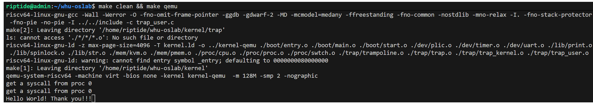

## 实验任务和⽬标
1. 通过深⼊分析xv6的进程管理机制，理解操作系统如何创建和管理进程。
2. 学会如何创建并切换到⽤户态的第⼀个进程proczero，并将其作为CPU核运⾏的第⼀个⽤户态进程。
3. 掌握如何处理⽤户态陷阱（含系统调⽤，中断，异常等），实现最基本的第⼀个进程的相关系统调⽤实现，最终在保证原有中断的情况下实现输出对应的系统调⽤信息。

## 运行测试

本实验中你需要运行以下测试。你使用的测试代码不用完全和下面的代码一样，你只用确保测试内容包括下面这些就可以了。考虑到你还要写实验报告，你的测试代码最好有相应中间过程输出，用来证明你完成了这个实验。

为了测试功能是否正常，根据代码可知，第⼀个核应该转移到⽤户态进程 proczero 并运⾏其中的代码，执⾏两次系统调⽤后进⼊死循环。如果系统转移到内核态运⾏代码，且成功输出两次系统调⽤的信息，且其他类型的中断功能保持正常，则本测试通过。

你只用观察相关输出是否正常就可以了。

你可以参考这个样例输出：

