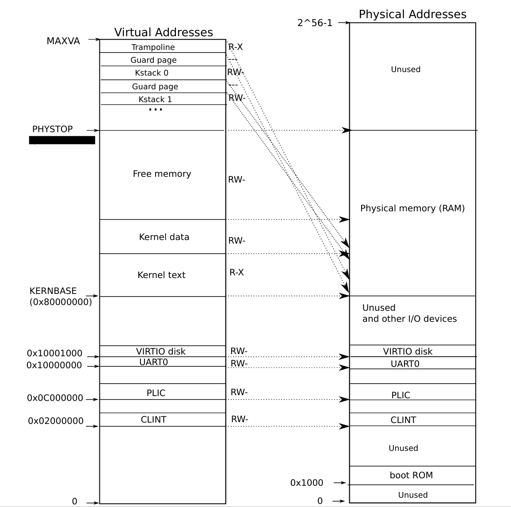
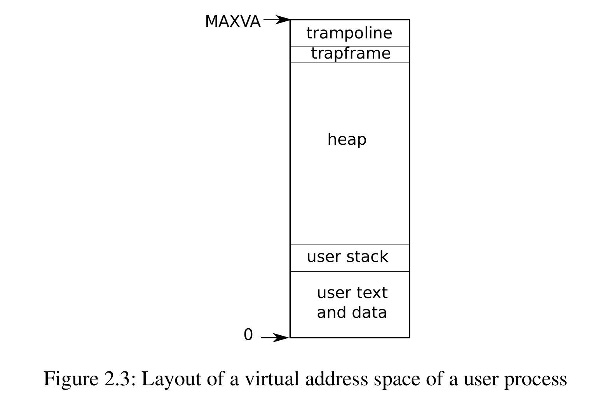
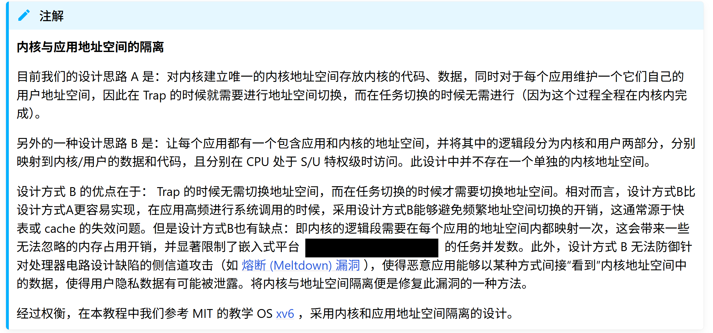
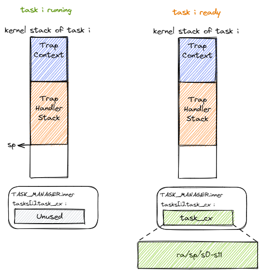
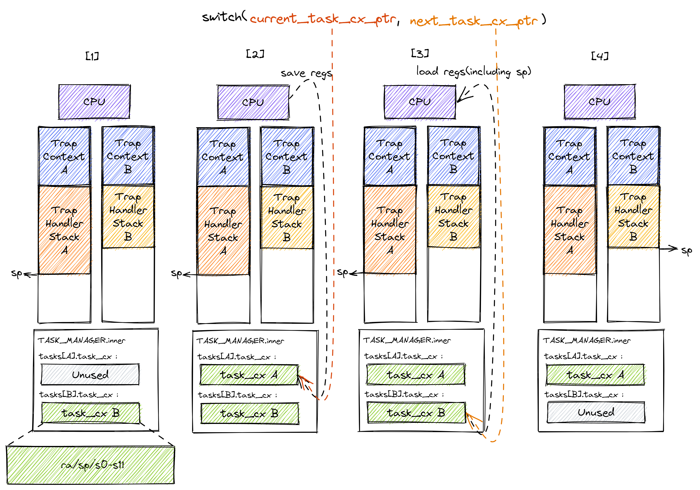

## 内核地址空间和应用地址空间

在实验四中，你需要实现第一个用户程序，并实现系统调用功能。我们要在这个实验中升级内核的地址空间，它除了仍然需要允许内核的各数据段能够被正常访问之后，还需要包含所有应用的内核栈以及一个 **跳板** (Trampoline) 。具体来说，你需要对现有的操作系统进行如下的功能扩展：

**·** 创建用户 Trap 上下文，在保存与恢复Trap上下文的过程中切换页表（即切换虚拟地址空间）；

**·** 建立用于内核地址空间与应用地址空间相互切换所需的跳板空间；

**·** 创建任务控制块包括虚拟内存相关信息，并在加载执行创建基于某应用的任务时，建立应用的虚拟地址空间；

**·** 创建用户 Trap 处理过程，支持分离的应用地址空间和内核地址空间。

在扩展了上述功能后，应用与应用之间，应用与操作系统内核之间通过硬件分页机制实现了内存空间隔离，且应用和内核之间还是能有效地进行相互访问，而且应用程序的编写也会更加简单通用。

下图是软件看到的 64 位内核地址空间（来源于 MIT 6.828 课程）。



可以看到，跳板放在最高的一个虚拟页面中。接下来则是从高到低放置每个应用的内核栈，它们的映射方式为 RW 两个标志位，意味着这个逻辑段仅允许 CPU 处于内核态访问，且只能读或写。

注意相邻两个内核栈之间会预留一个 保护页面 (Guard Page) ，它是内核地址空间中的空洞，多级页表中并不存在与它相关的映射。它的意义在于当内核栈空间不足（如调用层数过多或死递归）的时候，代码会尝试访问空洞区域内的虚拟地址，然而它无法在多级页表中找到映射，便会触发异常，此时控制权会交给内核 kerneltrap 函数进行异常处理。由于编译器会对访存顺序和局部变量在栈帧中的位置进行优化，我们难以确定一个已经溢出的栈帧中的哪些位置会先被访问，但总的来说，空洞区域被设置的越大，我们就能越早捕获到这一可能覆盖其他重要数据的错误异常。由于我们的内核非常简单且内核栈的大小设置比较宽裕，在当前的设计中我们仅将空洞区域的大小设置为单个页面。

现在我们来介绍如何创建应用的地址空间。我们希望效仿内核地址空间的设计，同样借助页表机制使得应用地址空间的各个逻辑段也可以有不同的访问方式限制，这样可以提早检测出应用的错误并及时将其终止以最小化它对系统带来的恶劣影响。

下图是软件看到的 64 位用户地址空间（来源于 MIT 6.828 课程）。



我们将起始地址 BASE_ADDRESS 设置为 $\text{0x10000}$ ，显然它只能是一个地址空间中的虚拟地址而非物理地址。事实上由于我们将入口汇编代码段放在最低的地方，这也是整个应用的入口点。我们只需清楚这一事实即可，而无需像之前一样将其硬编码到代码中。由于实验四中我们的用户代码比较少，而且用户代码没有用到 .data .rodata .bss 段，你只需要在本实验中映射一页作为 .text 段就可以了。

在用户代码之后，你需要映射用户栈、 trampoline 跳板页和 trapframe 页。从访问方式上来说你需要给映射到用户间的页都加上了 U 标志位代表 CPU 可以在 U 特权级也就是执行应用代码的时候访问它们。

## 跳板机制的实现

上一小节我们看到无论是内核还是应用的地址空间，最高的虚拟页面都是一个跳板。同时应用地址空间的次高虚拟页面还被设置为用来存放应用的 Trap 上下文。那么跳板究竟起什么作用呢？为何不直接把 Trap 上下文仍放到应用的内核栈中呢？

回忆曾在实验三介绍过的内核 Trap 上下文保存与恢复 。当内核出现 Trap 时，我们直接将 Trap 上下文压入内核栈栈顶。当 Trap 处理完毕返回的时候，我们将 Trap 上下文中的内容恢复到寄存器上。

然而，一旦到了用户程序，一切就并没有这么简单了，我们必须在这个过程中同时完成地址空间的切换。具体来说，当保存 Trap 上下文的时候，我们必须通过修改 satp 从应用地址空间切换到内核地址空间，因为用户 trap 处理函数只有在内核地址空间中才能访问；同理，在恢复 Trap 上下文的时候，我们也必须从内核地址空间切换回应用地址空间，因为应用的代码和数据只能在它自己的地址空间中才能访问，应用是看不到内核地址空间的。这样就要求地址空间的切换不能影响指令的连续执行，即要求应用和内核地址空间在切换地址空间指令附近是平滑的。



我们为何将应用的 Trap 上下文放到应用地址空间的次高页面而不是内核地址空间中的内核栈中呢？原因在于，在保存 Trap 上下文到内核栈中之前，我们必须完成两项工作：1）必须先切换到内核地址空间，这就需要将内核地址空间的 token 写入 satp 寄存器；2）之后还需要保存应用的内核栈栈顶的位置，这样才能以它为基址保存 Trap 上下文。这两步需要用寄存器作为临时周转，然而我们无法在不破坏任何一个通用寄存器的情况下做到这一点。因为事实上我们需要用到内核的两条信息：内核地址空间的 token ，以及应用的内核栈栈顶的位置，RISC-V却只提供一个 sscratch 寄存器可用来进行周转。所以，我们不得不将 Trap 上下文保存在应用地址空间的一个虚拟页面中，而不是切换到内核地址空间去保存。

### Trap 上下文

我们在 Trap 上下文中包含以下内容：
```
//kernel/proc.h

// per-process data for the trap handling code in trampoline.S.
// sits in a page by itself just under the trampoline page in the
// user page table. not specially mapped in the kernel page table.
// uservec in trampoline.S saves user registers in the trapframe,
// then initializes registers from the trapframe's
// kernel_sp, kernel_hartid, kernel_satp, and jumps to kernel_trap.
// usertrapret() and userret in trampoline.S set up
// the trapframe's kernel_*, restore user registers from the
// trapframe, switch to the user page table, and enter user space.
// the trapframe includes callee-saved user registers like s0-s11 because the
// return-to-user path via usertrapret() doesn't return through
// the entire kernel call stack.
struct trapframe {
  /*   0 */ uint64 kernel_satp;   // kernel page table
  /*   8 */ uint64 kernel_sp;     // top of process's kernel stack
  /*  16 */ uint64 kernel_trap;   // usertrap()
  /*  24 */ uint64 epc;           // saved user program counter
  /*  32 */ uint64 kernel_hartid; // saved kernel tp
  /*  40 */ uint64 ra;
  /*  48 */ uint64 sp;
  ······
  /* 272 */ uint64 t5;
  /* 280 */ uint64 t6;
};
```

在这些字段中：

**·** kernel_satp 表示内核地址空间的 token ，即内核页表的起始物理地址；

**·** kernel_sp 表示当前应用在内核地址空间中的内核栈栈顶的虚拟地址；

**·** kernel_trap 表示内核中 usertrap 入口点的虚拟地址；

**·** epc 表示应用程序在返回用户态调用 sret 时使用的 spec 寄存器的值；

**·** kernel_hartid 用来保存内核运行在的 hart 上的 id。我们在实验中只使用单核，这里仅是和 xv6 保持一；

**·** 最后我们保存了所有通用寄存器。

对于通用寄存器而言，两条控制流（应用程序控制流和内核控制流）运行在不同的特权级，所属的软件也可能由不同的编程语言编写，虽然在 Trap 控制流中只是会执行 Trap 处理相关的代码，但依然可能直接或间接调用很多模块，因此很难甚至不可能找出哪些寄存器无需保存。既然如此我们就只能全部保存了。但这里也有一些例外，如 x0 被硬编码为 0 ，它自然不会有变化；还有 tp(x4) 寄存器，除非我们手动出于一些特殊用途使用它，否则一般也不会被用到。虽然它们无需保存，但我们仍然在 TrapContext 中为它们预留空间，主要是为了后续的实现方便。

对于 CSR 而言，我们知道进入 Trap 的时候，硬件会立即覆盖掉 scause/stval/sstatus/sepc 的全部或是其中一部分。sstatus/scause/stval 的情况是：它总是在 Trap 处理的第一时间就被使用或者是在其他地方保存下来了，因此它没有被修改并造成不良影响的风险。而对于 sepc 而言，它们会在 Trap 处理的全程有意义（在 Trap 控制流最后 sret 的时候还用到了它们），而且确实会出现 Trap 嵌套的情况使得它们的值被覆盖掉。所以我们需要将它们也一起保存下来，并在 sret 之前恢复原样。

### 切换地址空间

让我们来看一下现在的 uservec 和 userret 各是如何在保存和恢复 Trap 上下文的同时也切换地址空间的：

```
//kernel/trampoline.S

#include "riscv.h"
#include "memlayout.h"

.section trampsec
.globl trampoline
trampoline:
.align 4
.globl uservec
uservec:    
	#
        # trap.c sets stvec to point here, so
        # traps from user space start here,
        # in supervisor mode, but with a
        # user page table.
        #

        # save user a0 in sscratch so
        # a0 can be used to get at TRAPFRAME.
        csrw sscratch, a0

        # each process has a separate p->trapframe memory area,
        # but it's mapped to the same virtual address
        # (TRAPFRAME) in every process's user page table.
        li a0, TRAPFRAME
        
        # save the user registers in TRAPFRAME
        sd ra, 40(a0)
        sd sp, 48(a0)
        ······
        sd t5, 272(a0)
        sd t6, 280(a0)

	# save the user a0 in p->trapframe->a0
        csrr t0, sscratch
        sd t0, 112(a0)

        # initialize kernel stack pointer, from p->trapframe->kernel_sp
        ld sp, 8(a0)

        # make tp hold the current hartid, from p->trapframe->kernel_hartid
        ld tp, 32(a0)

        # load the address of usertrap(), from p->trapframe->kernel_trap
        ld t0, 16(a0)


        # fetch the kernel page table address, from p->trapframe->kernel_satp.
        ld t1, 0(a0)

        # wait for any previous memory operations to complete, so that
        # they use the user page table.
        sfence.vma zero, zero

        # install the kernel page table.
        csrw satp, t1

        # flush now-stale user entries from the TLB.
        sfence.vma zero, zero

        # jump to usertrap(), which does not return
        jr t0

.globl userret
userret:
        # userret(pagetable)
        # called by usertrapret() in trap.c to
        # switch from kernel to user.
        # a0: user page table, for satp.

        # switch to the user page table.
        sfence.vma zero, zero
        csrw satp, a0
        sfence.vma zero, zero

        li a0, TRAPFRAME

        # restore all but a0 from TRAPFRAME
        ld ra, 40(a0)
        ld sp, 48(a0)
        ······
        ld t5, 272(a0)
        ld t6, 280(a0)

	# restore user a0
        ld a0, 112(a0)
        
        # return to user mode and user pc.
        # usertrapret() set up sstatus and sepc.
        sret
```

当应用 Trap 进入内核的时候，硬件会设置一些 CSR 并在 S 特权级下跳转到 uservec 保存 Trap 上下文。此时 sp 寄存器仍指向用户栈，我们这里使用 sscratch 寄存器临时保存 a0 寄存器的值，并设置 a0 寄存器指向应用地址空间中存放 Trap 上下文的位置 TRAPFRAME（实际在次高页面）。随后，就像之前一样，基于指向 Trap 上下文位置的 a0 开始保存通用寄存器。到这里，我们就全程在应用地址空间中完成了保存 Trap 上下文的工作。

接下来该考虑切换到内核地址空间并跳转到 trap handler 了。

**·** 首先直接将 sp 修改为应用内核栈顶的地址；

**·** 接着将当前的 hartid 载入到 tp 寄存器中；

**·** 将 usertrap 函数的虚拟地址载入到 t0 寄存器中；

**·** 接下来我们将内核地址空间的 token 载入到 t1 寄存器中；

**·** 接下来将 satp 修改为内核地址空间的 token 并使用 sfence.vma 刷新快表，这就切换到了内核地址空间；

**·** 最后通过 jr 指令跳转到 t0 寄存器所保存的 usertrap 函数的地址。

注：这里我们不能像之前的章节那样直接 call kerneltrap ，原因稍后解释。

当内核将 Trap 处理完毕准备返回用户态的时候会 调用 userret （符合RISC-V函数调用规范），它有一个参数,即将回到的应用的地址空间的 token ，在 a0 寄存器中传递。

**·** 首先切换回应用地址空间（注：Trap 上下文是保存在应用地址空间中）；

**·** 接着设置 a0 寄存器指向应用地址空间中存放 Trap 上下文的位置 TRAPFRAME；

**·** 然后基于 a0 恢复各通用寄存器,还有恢复 a0 的值；

**·** 最后通过 sret 指令返回用户态。

注意，调用 userret 时需要使用以下方式：

```
//kernel/trap.c

  // jump to userret in trampoline.S at the top of memory, which 
  // switches to the user page table, restores user registers,
  // and switches to user mode with sret.
  uint64 trampoline_userret = TRAMPOLINE + (userret - trampoline);
  ((void (*)(uint64))trampoline_userret)(satp);
```

这是由于开启分页后我们的 userret 在虚拟地址 TRAMPOLINE 那里，而我们的编译器只能看到 userret 函数的物理地址，所以我们要算出 userret 函数的虚拟地址然后告诉编译器跳转到那里。

跳转到 usertrap 函数后，由于当前未实现真正的系统调⽤，所以在系统调⽤部分直接输出调试信息即可：

```
//像这样
if(scause == 8){ 
// system call 
// if(killed(p)) exit(-1); 
// sepc points to the ecall instruction, 
// but we want to return to the next instruction. 
        p->tf->epc += 4; 
printf("get a syscall from proc %d\n", p->pid); 
// syscall(); 
// an interrupt will change sepc, scause, and sstatus, 
// so enable only now that we're done with those registers. 
        intr_on(); 
    } 
else if (isInterrupt) { 
```

### 建立跳板页面
接下来还需要考虑切换地址空间前后指令能否仍能连续执行。可以看到我们将 trampoline.S 中的整段汇编代码放置在 .trampsec 段，并在调整内存布局的时候将它对齐到代码段的一个页面中：

```
//kernel/kernel.ld

  .text : {
    *(.text .text.*)
    . = ALIGN(0x1000);
    _trampoline = .;
    *(trampsec)
    . = ALIGN(0x1000);
    ASSERT(. - _trampoline == 0x1000, "error: trampoline larger than one page");
    PROVIDE(etext = .);
  }
```

这样，这段汇编代码放在一个物理页帧中，且 uservec 恰好位于这个物理页帧的开头，其物理地址被外部符号 _trampoline 标记。在开启分页模式之后，内核和应用代码都只能看到各自的虚拟地址空间，而在它们的视角中，这段汇编代码都被放在它们各自地址空间的最高虚拟页面上，由于这段汇编代码在执行的时候涉及到地址空间切换，故而被称为跳板页面。

在产生trap前后的一小段时间内会有一个比较 极端 的情况，即刚产生trap时，CPU已经进入了内核态（即Supervisor Mode），但此时执行代码和访问数据还是在应用程序所处的用户态虚拟地址空间中，而不是我们通常理解的内核虚拟地址空间。在这段特殊的时间内，CPU指令为什么能够被连续执行呢？这里需要注意：无论是内核还是应用的地址空间，跳板的虚拟页均位于同样位置，且它们也将会映射到同一个实际存放这段汇编代码的物理页帧。也就是说，在执行 uservec 或 userret 函数进行地址空间切换的时候，应用的用户态虚拟地址空间和操作系统内核的内核态虚拟地址空间对切换地址空间的指令所在页的映射方式均是相同的，这就说明了这段切换地址空间的指令控制流仍是可以连续执行的。

现在可以说明我们在创建用户/内核地址空间中用到的 map_trampoline 是如何实现的了：

```
//kernel/vm.c

// Make a direct-map page table for the kernel.
pagetable_t
kvmmake(void)
{
  pagetable_t kpgtbl;

  kpgtbl = (pagetable_t) kalloc();
  memset(kpgtbl, 0, PGSIZE);

  ······

  // map the trampoline for trap entry/exit to
  // the highest virtual address in the kernel.
  kvmmap(kpgtbl, TRAMPOLINE, (uint64)trampoline, PGSIZE, PTE_R | PTE_X);

  ······
  
  return kpgtbl;
}
```

这里我们直接在多级页表中插入一个从地址空间的最高虚拟页面映射到跳板汇编代码所在的物理页帧的键值对，访问权限与代码段相同，即 RX （可读可执行）。

最后可以解释为何我们在 uservec 中需要借助寄存器 jr 而不能直接 call usertrap 了。因为在内存布局中，这条 .trampsec 段中的跳转指令和 usertrap 都在代码段之内，汇编器（Assembler）和链接器（Linker）会根据 kernel/kernel.ld 的地址布局描述，设定跳转指令的地址，并计算二者地址偏移量，让跳转指令的实际效果为当前 pc 自增这个偏移量。但实际上由于我们设计的缘故，这条跳转指令在被执行的时候，它的虚拟地址被操作系统内核设置在地址空间中的最高页面之内，所以加上这个偏移量并不能正确的得到 usertrap 的入口地址。

问题的本质可以概括为：跳转指令实际被执行时的虚拟地址和在编译器/汇编器/链接器进行后端代码生成和链接形成最终机器码时设置此指令的地址是不同的。

## 任务切换

本节的重点是操作系统的核心机制—— 任务切换 ，在内核中这种机制是在 swtch 函数中实现的。 任务切换支持的场景是：一个程序在运行途中便会主动或被动交出 CPU 的使用权，此时它只能暂停执行，等到内核重新给它分配处理器资源之后才能恢复并继续执行。

### 任务的概念形成
如果操作系统能够在某个应用程序处于等待阶段的时候，把处理器转给另外一个处于计算阶段的应用程序，那么只要转换的开销不大，那么处理器的执行效率就会大大提高。当然，这需要应用程序在运行途中能主动交出 CPU 的使用权，此时它处于等待阶段，等到操作系统让它再次执行后，那它就可以继续执行了。

到这里，我们就把应用程序的一次执行过程（也是一段控制流）称为一个 **任务** ，把应用执行过程中的一个时间片段上的执行片段或空闲片段称为 “ **计算任务片** ” 或“ **空闲任务片** ” 。当应用程序的所有任务片都完成后，应用程序的一次任务也就完成了。从一个程序的任务切换到另外一个程序的任务称为 **任务切换** 。为了确保切换后的任务能够正确继续执行，操作系统需要支持让任务的执行“暂停”和“继续”。

我们又看到了熟悉的“暂停-继续”组合。一旦一条控制流需要支持“暂停-继续”，就需要提供一种控制流切换的机制，而且需要保证程序执行的控制流被切换出去之前和切换回来之后，能够继续正确执行。这需要让程序执行的状态（也称上下文），即在执行过程中同步变化的资源（如寄存器、栈等）保持不变，或者变化在它的预期之内。不是所有的资源都需要被保存，事实上只有那些对于程序接下来的正确执行仍然有用，且在它被切换出去的时候有被覆盖风险的那些资源才有被保存的价值。这些需要保存与恢复的资源被称为 **任务上下文** (Task Context) 。


## 不同类型的上下文与切换
在控制流切换过程中，我们需要结合硬件机制和软件实现来保存和恢复任务上下文。任务的一次切换涉及到被换出和即将被换入的两条控制流（分属两个应用的不同任务），通常它们都需要共同遵循某些约定来合作完成这一过程。在之前的实验中，我们已经看到了两种上下文保存/恢复的实例。让我们再来回顾一下它们：

**·** 实验一中，我们介绍了函数调用与栈。当时提到过，为了支持嵌套函数调用，不仅需要硬件平台提供特殊的跳转指令，还需要保存和恢复 函数调用上下文 。注意在上述定义中，函数调用包含在普通控制流（与异常控制流相对）之内，且始终用一个固定的栈来保存执行的历史记录，因此函数调用并不涉及控制流的特权级切换。但是我们依然可以将其看成调用者和被调用者两个执行过程的“切换”，二者的协作体现在它们都遵循调用规范，分别保存一部分通用寄存器，这样的好处是编译器能够有足够的信息来尽可能减少需要保存的寄存器的数目。虽然当时用了很大的篇幅来说明，但其实整个过程都是编译器负责完成的，我们只需设置好栈就行了。

**·** 实验三中第一次涉及到了某种异常（Trap）控制流，即两条控制流的特权级切换，需要保存和恢复 Trap 上下文 。

### 任务切换的设计与实现

本节所讲的任务切换是实验三提及的 Trap 控制流切换之外的另一种异常控制流，都是描述两条控制流之间的切换，如果将它和 Trap 切换进行比较，会有如下异同：

**·** 与 Trap 切换不同，它不涉及特权级切换；

**·** 与 Trap 切换不同，它的一部分是由编译器帮忙完成的；

**·** 与 Trap 切换相同，它对应用是透明的。

事实上，任务切换是来自两个不同应用在内核中的 Trap 控制流之间的切换。当一个应用 Trap 到 S 模式的操作系统内核中进行进一步处理（即进入了操作系统的 Trap 控制流）的时候，其 Trap 控制流可以调用一个特殊的 swtch 函数。这个函数表面上就是一个普通的函数调用：在 swtch 返回之后，将继续从调用该函数的位置继续向下执行。但是其间却隐藏着复杂的控制流切换过程。具体来说，调用 swtch 之后直到它返回前的这段时间，原 Trap 控制流 A 会先被暂停并被切换出去， CPU 转而运行另一个应用在内核中的 Trap 控制流 B 。然后在某个合适的时机，原 Trap 控制流 A 才会从某一条 Trap 控制流 C （很有可能不是它之前切换到的 B ）切换回来继续执行并最终返回。不过，从实现的角度讲， swtch 函数和一个普通的函数之间的核心差别仅仅是它会 **换栈** 。



当 Trap 控制流准备调用 swtch 函数使任务从运行状态进入暂停状态的时候，让我们考察一下它内核栈上的情况。如上图左侧所示，在准备调用 swtch 函数之前，内核栈上从栈底到栈顶分别是保存了应用执行状态的 Trap 上下文以及内核在对 Trap 处理的过程中留下的调用栈信息。由于之后还要恢复回来执行，我们必须保存 CPU 当前的某些寄存器，我们称它们为 **任务上下文** (Task Context)。我们会在稍后介绍里面需要包含哪些寄存器。至于上下文保存的位置，之后的实验中在我们会介绍任务管理器数组 proc ，其中的每一项都是一个任务控制块即 proc ，它负责保存一个任务的状态，而任务上下文 context 被保存在任务控制块中。当我们将任务上下文保存完毕之后则转化为下图右侧的状态。当要从其他任务切换回来继续执行这个任务的时候，CPU 会读取同样的位置并从中恢复任务上下文。

注：和图中不同，本实验中的 TaskManager 为 数组 proc，你可以在 kernel/proc.c 中找到这个数组。

对于当前正在执行的任务的 Trap 控制流，我们用一个名为 current_task_cx_ptr 的变量来保存放置当前任务上下文的地址；而用 next_task_cx_ptr 的变量来保存放置下一个要执行任务的上下文的地址。利用 C 语言的引用来描述的话就是：

context *current_task_cx_ptr = &mycpu()->ctx;

context *next_task_cx_ptr    = &proczero.ctx;

接下来我们同样从栈上内容的角度来看 swtch 的整体流程：



Trap 控制流在调用 swtch 之前就需要明确知道即将切换到哪一条目前正处于暂停状态的 Trap 控制流，因此 swtch 有两个参数，第一个参数代表它自己，第二个参数则代表即将切换到的那条 Trap 控制流。这里我们用上面提到过的 current_task_cx_ptr 和 next_task_cx_ptr 作为代表。在上图中我们假设某次 swtch 调用要从 Trap 控制流 A 切换到 B，一共可以分为四个阶段，在每个阶段中我们都给出了 A 和 B 内核栈上的内容。

**·** 阶段 [1]：在 Trap 控制流 A 调用 swtch 之前，A 的内核栈上只有 Trap 上下文和 Trap 处理函数的调用栈信息，而 B 是之前被切换出去的；

**·** 阶段 [2]：A 在 A 任务上下文空间在里面保存 CPU 当前的寄存器快照；

**·** 阶段 [3]：这一步极为关键，读取 next_task_cx_ptr 指向的 B 任务上下文，根据 B 任务上下文保存的内容来恢复 ra 寄存器、s0~s11 寄存器以及 sp 寄存器。只有这一步做完后， swtch 才能做到一个函数跨两条控制流执行，即 通过换栈也就实现了控制流的切换 。

**·** 阶段 [4]：上一步寄存器恢复完成后，可以看到通过恢复 sp 寄存器换到了任务 B 的内核栈上，进而实现了控制流的切换。这就是为什么 swtch 能做到一个函数跨两条控制流执行。此后，当 CPU 执行 ret 汇编伪指令完成 swtch 函数返回后，任务 B 可以从调用 swtch 的位置继续向下执行。

从结果来看，我们看到 A 控制流 和 B 控制流的状态发生了互换， A 在保存任务上下文之后进入暂停状态，而 B 则恢复了上下文并在 CPU 上继续执行。

下面我们给出 swtch 的实现：

```
//kernel/swtch.S

# Context switch
#
#   void swtch(struct context *old, struct context *new);
# 
# Save current registers in old. Load from new.	


.globl swtch
swtch:
        sd ra, 0(a0)
        sd sp, 8(a0)
        sd s0, 16(a0)
        sd s1, 24(a0)
        sd s2, 32(a0)
        sd s3, 40(a0)
        sd s4, 48(a0)
        sd s5, 56(a0)
        sd s6, 64(a0)
        sd s7, 72(a0)
        sd s8, 80(a0)
        sd s9, 88(a0)
        sd s10, 96(a0)
        sd s11, 104(a0)

        ld ra, 0(a1)
        ld sp, 8(a1)
        ld s0, 16(a1)
        ld s1, 24(a1)
        ld s2, 32(a1)
        ld s3, 40(a1)
        ld s4, 48(a1)
        ld s5, 56(a1)
        ld s6, 64(a1)
        ld s7, 72(a1)
        ld s8, 80(a1)
        ld s9, 88(a1)
        ld s10, 96(a1)
        ld s11, 104(a1)
        
        ret
```

我们手写汇编代码来实现 swtch 。在阶段 [1] 可以看到它的函数原型中的两个参数分别是当前 A 任务上下文指针 current_task_cx_ptr 和即将被切换到的 B 任务上下文指针 next_task_cx_ptr ，从 RISC-V 调用规范 可以知道它们分别通过寄存器 a0/a1 传入。阶段 [2] 即将当前 CPU 状态（包括 ra 寄存器、 s0~s11 寄存器以及 sp 寄存器）保存到 A 任务上下文。相对的，阶段 [3] 即根据 B 任务上下文保存的内容来恢复上述 CPU 状态。从中我们也能够看出 context 结构 里面究竟包含哪些寄存器：

```
//kernel/proc.h

// Saved registers for kernel context switches.
struct context {
  uint64 ra;
  uint64 sp;

  // callee-saved
  uint64 s0;
  uint64 s1;
  uint64 s2;
  uint64 s3;
  uint64 s4;
  uint64 s5;
  uint64 s6;
  uint64 s7;
  uint64 s8;
  uint64 s9;
  uint64 s10;
  uint64 s11;
};
```

保存 ra 很重要，它记录了 swtch 函数返回之后应该跳转到哪里继续执行，从而在任务切换完成并 ret 之后能到正确的位置。对于一般的函数而言，C 编译器会在函数的起始位置自动生成代码来保存 s0~s11 这些被调用者保存的寄存器。但 swtch 是一个用汇编代码写的特殊函数，它不会被 C 编译器处理，所以我们需要在 swtch 中手动编写保存 s0~s11 的汇编代码。 不用保存其它寄存器是因为：其它寄存器中，属于调用者保存的寄存器是由编译器在高级语言编写的调用函数中自动生成的代码来完成保存的；还有一些寄存器属于临时寄存器，不需要保存和恢复。

我们会调用 swtch 函数来完成切换功能。因此在调用前后 C 编译器会自动帮助我们插入保存/恢复调用者保存寄存器的汇编代码。

仔细观察的话可以发现 context 结构 很像一个普通函数栈帧中的内容。正如之前所说， swtch 的实现除了换栈之外几乎就是一个普通函数，也能在这里得到体现。尽管如此，二者的内涵却有着很大的不同。

## 执行应用程序

当操作系统初始化完成时，我们要切换到我们的第一个应用程序。此时 CPU 运行在 S 特权级，而它希望能够切换到 U 特权级。在 RISC-V 架构中，唯一一种能够使得 CPU 特权级下降的方法就是执行 Trap 返回的特权指令，如 sret 、mret 等。事实上，在从操作系统内核返回到运行应用程序之前，要完成如下这些工作：

**·** 构造应用程序的页表；

**·** 构造应用程序开始执行所需的 Trap 上下文；

**·** 设置应用 Trap 上下文 sepc CSR 的内容为应用程序入口点 0x0；

**·** 设置应用 Trap 上下文 sp 寄存器，设置 sp 指向应用程序用户栈；

**·** 设置应用 context 上下文 ra 寄存器的内容为 usertrapret 函数；

**·** 设置应用 context 上下文 sp 寄存器，设置 sp 指向应用程序内核栈。

它们可以通过复用 usertrapret 的代码来更容易的实现上述工作。初始化应用程序的过程你可以参考以下代码：

```
void proc_make_first()
{   
    // pid 设置
    proczero.pid = 0;

    // pagetable 初始化
    ······

    // tf字段设置
    proczero.tf = (struct trapframe *)trapframe_page;
    memset(proczero.tf, 0, sizeof(*proczero.tf));
    // 设置用户态返回时的关键寄存器
    proczero.tf->epc = 0; // 程序计数器，从虚拟地址0开始执行initcode
    proczero.tf->sp = PGSIZE; // 用户栈指针，设置在用户空间顶部

    // 内核字段设置
    memset(&proczero.ctx, 0, sizeof(&proczero.ctx));
    proczero.ctx.ra = (uint64)usertrapret;
    proczero.ctx.sp = proczero.kstack + PGSIZE;

    // 上下文切换
    mycpu()->proc = &proczero;
    swtch(&mycpu()->ctx, &proczero.ctx);
}
```

完成了以上工作后，你就可以尝试启动你的第一个应用程序了。